# Reporting, Traceability & Project Management Strategy

**Project**: IMS Gen2 HLM Platform
**Author**: John (PM Agent) / Gaurav Makkar
**Date**: 2026-03-26
**Status**: DRAFT - Pending Team Review
**Audience**: Engineering Team, Management, Client Stakeholders

---

## Table of Contents

1. [Executive Summary](#1-executive-summary)
2. [Current State Analysis](#2-current-state-analysis)
3. [Recommendation: GitHub-Native Stack](#3-recommendation-github-native-stack)
4. [Jira-to-GitHub Projects: Complete Replacement Guide](#4-jira-to-github-projects-complete-replacement-guide)
5. [Recommendation: Mono-Repo](#5-recommendation-mono-repo-merge-qa-into-dev-repo)
6. [End-to-End Traceability Framework](#6-end-to-end-traceability-framework)
7. [CI/CD Pipeline Design](#7-cicd-pipeline-design)
8. [Story-to-Bug Traceability (The Bug Loop)](#8-story-to-bug-traceability-the-bug-loop)
9. [Claude as Project Command Center (MCP Integration)](#9-claude-as-project-command-center-mcp-integration)
10. [GitHub Actions: The Automated Enforcement Layer](#10-github-actions-the-automated-enforcement-layer)
11. [Implementation Roadmap](#11-implementation-roadmap)
12. [Step-by-Step Setup Guide](#12-step-by-step-setup-guide)
13. [Risk Assessment](#13-risk-assessment)
14. [Decision Matrix Summary](#14-decision-matrix-summary)
15. [What You Lose vs Jira (Honest Assessment)](#15-what-you-lose-vs-jira-honest-assessment)
16. [Quick-Start Checklist](#16-quick-start-checklist)
17. [Appendices](#appendix-a-recommended-packagejson-scripts)

---

## 1. Executive Summary

This document presents a comprehensive strategy for project reporting, traceability, and tooling consolidation for the IMS Gen2 platform. It addresses three key decisions:

1. **GitHub Projects** as the replacement for Jira/Azure ADO
2. **Mono-repo consolidation** — merging QA automation into the main repo
3. **End-to-end traceability** — from story to code to test to deployment

The recommendation is to adopt a **GitHub-native, mono-repo approach** that eliminates tool sprawl, reduces context-switching, and provides management with the sprint/build visibility they need — all without license costs.

### High-Level Architecture (Before vs After)

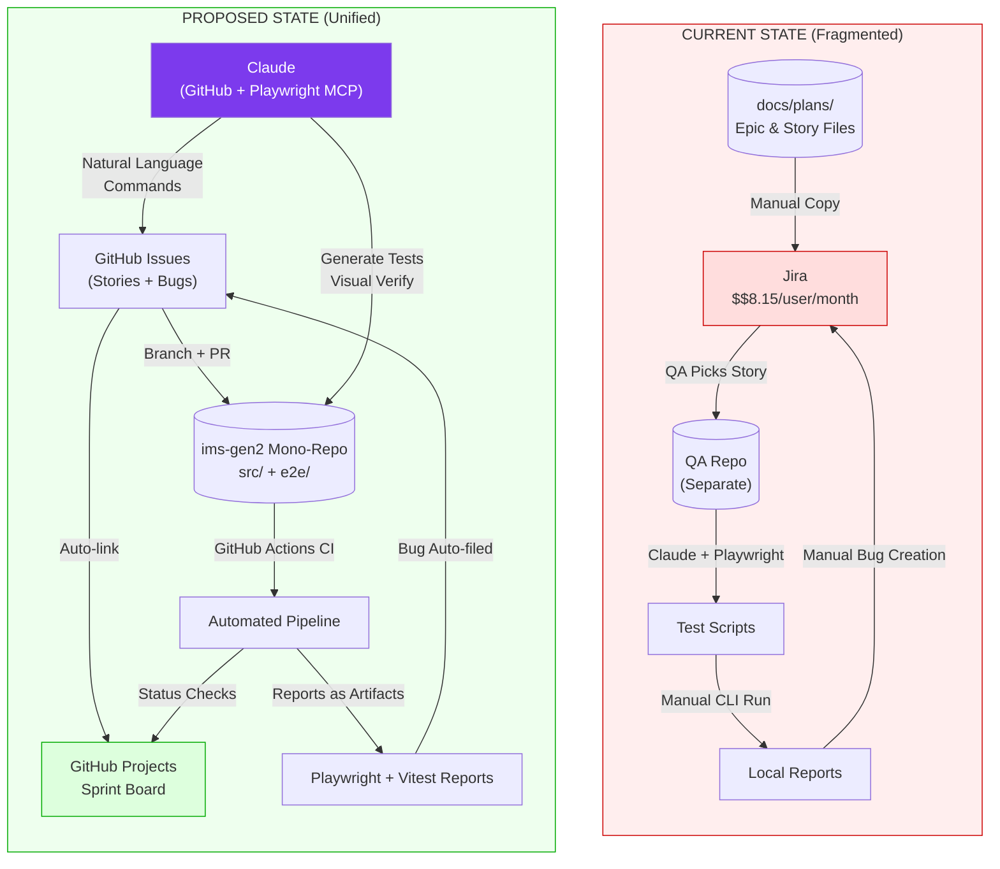

---

## 2. Current State Analysis

### 2.1 Current Workflow

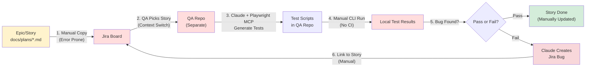

### 2.2 Pain Points Identified

| # | Pain Point | Impact |
|---|-----------|--------|
| 1 | **Dual source of truth** — Stories live in `docs/plans/*.md` AND Jira | Story drift, manual sync overhead |
| 2 | **Tool uncertainty** — Management may drop Jira/ADO | Wasted integration investment |
| 3 | **Separate QA repo** — Same team, two repos | Context switching, broken traceability links |
| 4 | **Manual story transfer** — Copy stories to Jira by hand | Error-prone, time sink |
| 5 | **No automated reporting** — No sprint board reflecting real-time status | Management has no visibility |
| 6 | **CLI-only test execution** — Tests run manually, reports live locally | No historical trend data, no CI integration |
| 7 | **Disconnected traceability** — Code commits don't link to stories/tests | Audit/compliance gap (NIST AU-12) |

### 2.3 Pain Points Heat Map

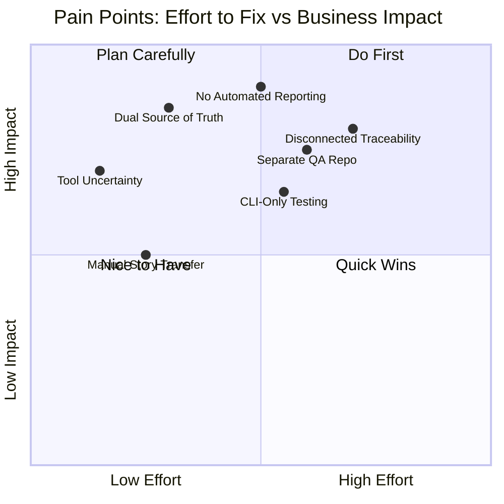

---

## 3. Recommendation: GitHub-Native Stack

### 3.1 Why GitHub Projects (Not Jira, Not ADO)

| Criterion | GitHub Projects | Jira | Azure ADO |
|-----------|----------------|------|-----------|
| **Cost** | Free (included with GitHub) | $8.15/user/month | $6/user/month |
| **Code integration** | Native — PRs, commits, branches auto-link | Plugin/webhook required | Good if using Azure Repos |
| **CI/CD integration** | GitHub Actions (already in use) | Requires 3rd-party CI or Jira plugin | Tight with Azure Pipelines |
| **Board views** | Kanban, Table, Roadmap, Timeline | Kanban, Board, Timeline | Kanban, Board, Sprint |
| **Custom fields** | Yes — Sprint, Priority, Estimate, custom dropdowns | Yes (extensive) | Yes (extensive) |
| **Automation** | Built-in (auto-move on PR merge, close on commit) | Jira Automation (powerful) | Work item rules |
| **API/CLI** | `gh` CLI, GraphQL API | REST API | REST API |
| **Learning curve** | Low (team already uses GitHub) | Medium | Medium |
| **Client sharing** | Public project boards or guest access | Requires Jira license per viewer | Stakeholder access license |
| **Sprint support** | Iteration fields (custom) | Native sprints | Native sprints |
| **Reporting** | Insights charts (velocity, burn-up, distribution) | Dashboards, Gadgets | Analytics views, widgets |

**Verdict**: GitHub Projects covers 90% of what Jira offers for a team your size, with zero additional cost, zero context-switching, and native code-to-board traceability. The 10% you lose (advanced JQL queries, extensive report templates) is not needed for a same-team POC/R&D phase.

### 3.2 Tool Consolidation Diagram

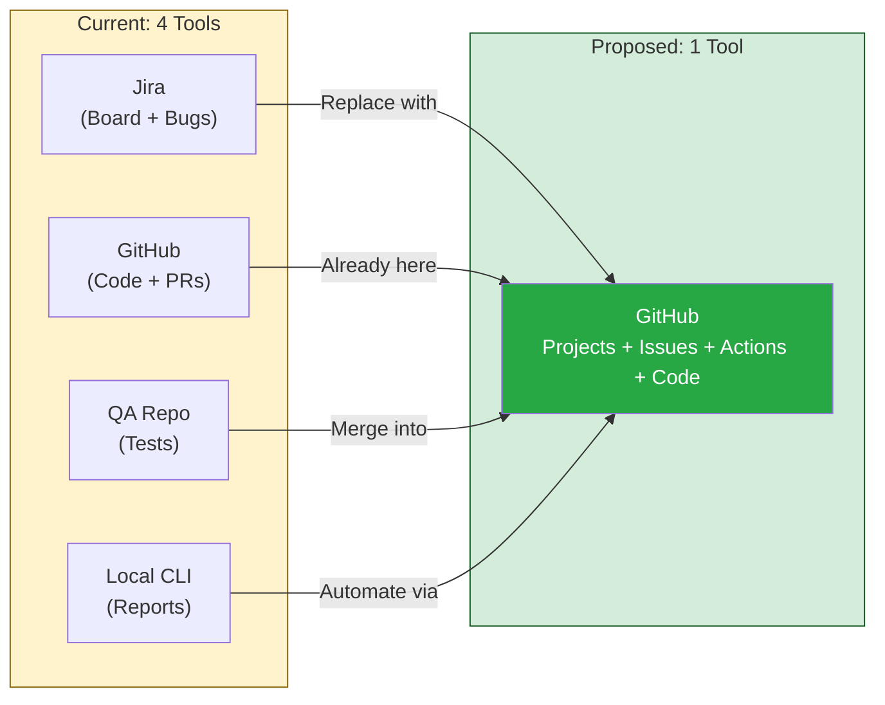

### 3.3 GitHub Projects — What Management Gets

Management asked for: **"A board reflecting what's happening for a particular sprint/build cycle, how many bugs are open, and something to show clients."**

GitHub Projects delivers this:

| Management Need | GitHub Projects Feature |
|----------------|------------------------|
| Sprint board | **Board view** with custom "Sprint" iteration field, columns: Backlog / In Progress / In Review / Done |
| Bug count | **Filter view**: `label:bug is:open` — shows count in view header |
| Build cycle status | **GitHub Actions** status badges + checks linked to PRs on the board |
| Client-facing view | **Public project board** (read-only) or export to PDF/screenshot |
| Velocity/burndown | **Insights tab** — built-in charts: items by sprint, burn-up, distribution by assignee/label |
| Compliance evidence | **Audit log** — GitHub Enterprise tracks all project changes; for non-enterprise, PR history serves as audit trail |

### 3.4 GitHub Projects — Recommended Board Structure

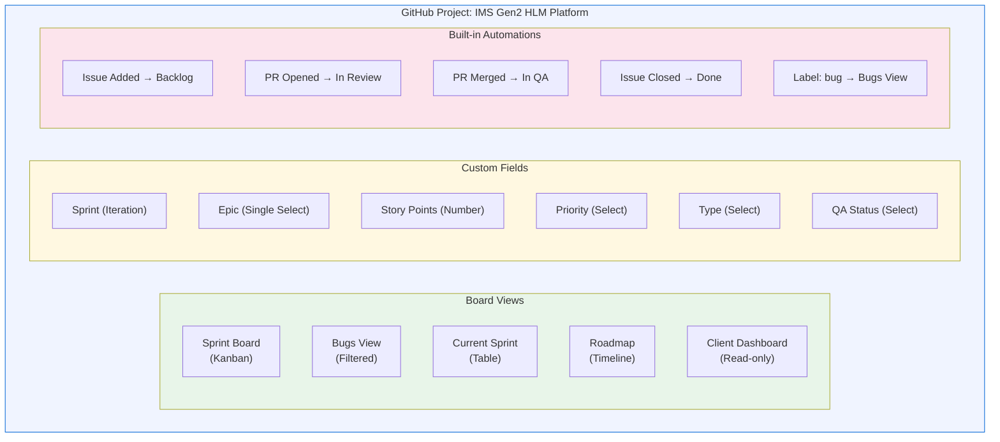

**Sprint Board Columns:**

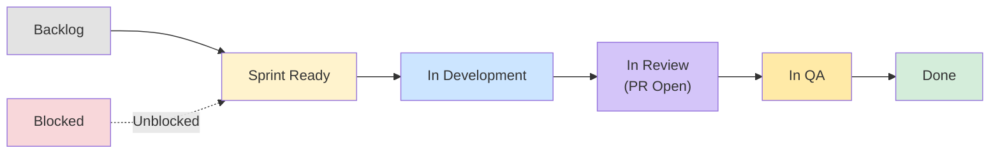

**Custom Fields:**
- `Sprint` (Iteration) — e.g., Sprint 12, Sprint 13
- `Epic` (Single select) — Epic 8, 9, 10, 11...
- `Story Points` (Number)
- `Priority` (Single select) — Critical, High, Medium, Low
- `Type` (Single select) — Story, Bug, Task, Spike
- `QA Status` (Single select) — Not Started, Tests Written, Passing, Failing

---

## 4. Jira-to-GitHub Projects: Complete Replacement Guide

This section maps **every Jira concept** to its GitHub Projects equivalent, so the team has zero ambiguity during migration.

### 4.1 Concept-by-Concept Mapping

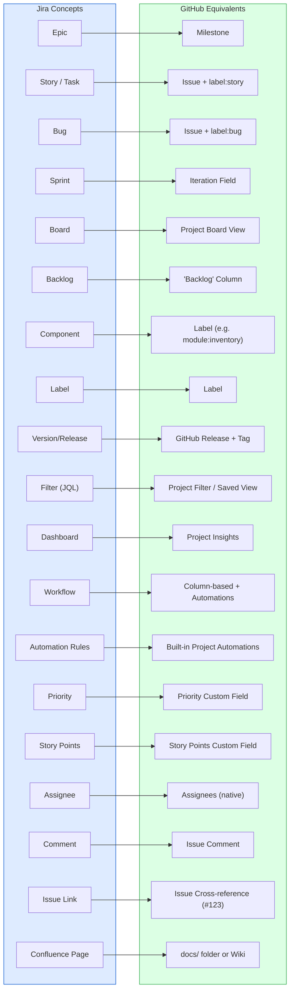

### 4.2 Detailed Mapping Table

| Jira Concept | GitHub Projects Equivalent | How to Set Up | Notes |
|-------------|--------------------------|---------------|-------|
| **Project** | GitHub Project (V2) | Settings → Projects → New | One project per product |
| **Epic** | **Milestone** | Issues → Milestones → New | Groups stories; shows % complete progress bar |
| **Story** | **Issue** + `label:story` | Issue → New → apply template | Use Story issue template |
| **Task** | **Issue** + `label:task` | Issue → New → apply label | Sub-work items |
| **Sub-task** | **Task list** in Issue body | `- [ ] Sub-task description` | Checkbox items in issue body; shows progress |
| **Bug** | **Issue** + `label:bug` | Issue → New → Bug template | Auto-added to Bugs view via automation |
| **Sprint** | **Iteration** custom field | Project → Settings → Iterations | Define 2-week cycles; `@current`, `@next` filters |
| **Board** | **Board view** in Project | Project → New View → Board | Kanban columns mapped to Status field |
| **Backlog** | **Backlog column** or No Sprint | Filter: `no:iteration` | Items without a sprint assigned |
| **Component** | **Labels** (prefixed) | `module:inventory`, `module:deployment` | Multi-label for cross-module work |
| **Priority** | **Custom field** (Single select) | Project → Settings → Fields | Critical / High / Medium / Low |
| **Story Points** | **Custom field** (Number) | Project → Settings → Fields | Number field; used in Insights velocity |
| **Version/Release** | **GitHub Release** + **Git Tag** | Releases → Draft new | `v1.2.0` tag → auto-generates changelog |
| **Filter (JQL)** | **Saved View** with filters | Project → New View → Filter | `label:bug is:open assignee:@me` |
| **Dashboard** | **Insights** tab | Project → Insights | Burn-up, distribution, velocity charts |
| **Workflow** | **Status field** + Columns | Board columns = workflow states | Backlog → Dev → Review → QA → Done |
| **Automation** | **Built-in automations** | Project → Workflows (3-dot menu) | Auto-set status on PR events |
| **Issue Link** | **Cross-reference** (`#123`) | Type `#` in any issue/PR body | Bi-directional linking; "mentioned in" sidebar |
| **Watcher** | **Subscriber** | Issue sidebar → Subscribe | Auto-subscribed on mention or assignment |
| **Confluence** | **`docs/` folder** or **Wiki** | Already have `docs/` in repo | Linked from issues; version-controlled |

### 4.3 Sprint Lifecycle: Jira vs GitHub Projects

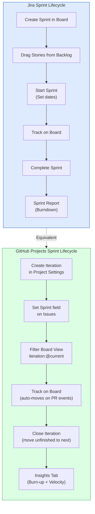

### 4.4 What Management Sees: GitHub Projects Dashboard

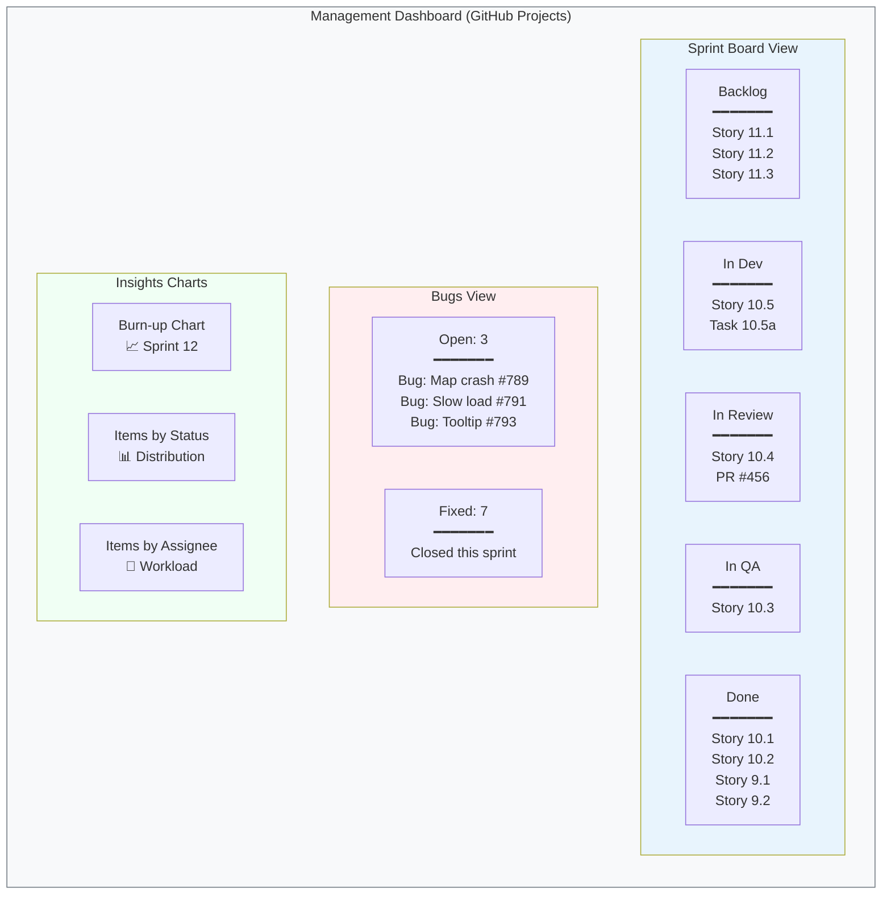

### 4.5 Migration Checklist: Jira to GitHub Projects

| # | Jira Artifact | Action | GitHub Target |
|---|--------------|--------|---------------|
| 1 | Jira Epics | Create as **Milestones** | `Epic 8: Dashboard`, `Epic 10: Location Service`, etc. |
| 2 | Jira Stories | Create as **Issues** with story template | Apply `label:story` + assign to Milestone |
| 3 | Jira Bugs | Create as **Issues** with bug template | Apply `label:bug` + link to parent story |
| 4 | Sprint 1, 2, 3... | Create **Iterations** in Project settings | 2-week cycles starting from current sprint |
| 5 | Board columns | Map to **Status field** values | Backlog, Sprint Ready, In Dev, In Review, In QA, Done |
| 6 | Jira Filters | Create **Saved Views** | `My Work`, `Bugs`, `Current Sprint`, `By Epic` |
| 7 | Jira Automations | Set up **Project Automations** | PR→In Review, Merge→In QA, Close→Done |
| 8 | Jira Dashboard | Use **Insights** tab | Burn-up, velocity, distribution charts |

---

## 5. Recommendation: Mono-Repo (Merge QA into Dev Repo)

### 5.1 The Case for Mono-Repo

Given that **the same team does both Dev and QA**, separate repos create unnecessary friction:

| Factor | Separate Repos | Mono-Repo (Recommended) |
|--------|---------------|------------------------|
| **Who works on both?** | Same people, two repos | Same people, one repo |
| **PR traceability** | Feature PR in repo A, test PR in repo B — no link | One PR contains feature + tests |
| **CI integration** | QA repo needs webhook to trigger on Dev merge | Single pipeline: build → unit test → e2e test |
| **Story-to-test link** | Manual cross-referencing | Test file lives next to feature; both reference same issue |
| **Dependency sync** | QA tests break when Dev changes API — discovered late | Tests fail immediately in same PR |
| **Onboarding** | "Clone both repos, set up both..." | "Clone this repo, run npm install" |
| **Industry standard** | Used when QA is a separate org/vendor | Used when Dev and QA are the same team |

### 5.2 Repo Structure: Before and After

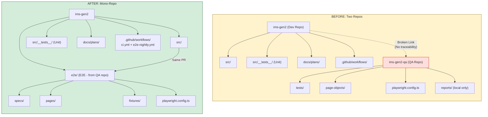

### 5.3 Proposed Folder Structure (Detailed)

```
ims-gen2/
├── src/                          # Application source
│   ├── app/components/           # React components
│   ├── lib/                      # Shared libraries
│   └── __tests__/                # Unit + integration tests (existing)
│       ├── components/           # Component tests (existing)
│       ├── resolvers/            # Resolver tests (existing)
│       ├── compliance/           # Compliance tests (existing)
│       └── integration/          # Integration tests (existing)
│
├── e2e/                          # << NEW: End-to-end tests (from QA repo)
│   ├── fixtures/                 # Test data, mock devices, seed scripts
│   ├── pages/                    # Page Object Models (Playwright)
│   │   ├── dashboard.page.ts
│   │   ├── inventory.page.ts
│   │   ├── deployment.page.ts
│   │   ├── compliance.page.ts
│   │   └── account-service.page.ts
│   ├── specs/                    # Test specifications
│   │   ├── dashboard/
│   │   ├── inventory/
│   │   ├── deployment/
│   │   ├── compliance/
│   │   ├── search/               # OpenSearch: global search, aggregations, geo queries
│   │   └── smoke/                # Smoke test suite (quick pass/fail)
│   ├── reports/                  # Generated test reports (gitignored)
│   ├── playwright.config.ts      # Playwright configuration
│   └── README.md                 # QA setup and run instructions
│
├── .github/
│   ├── ISSUE_TEMPLATE/           # << NEW: Story, Bug, Spike templates
│   │   ├── story.yml
│   │   ├── bug.yml
│   │   └── spike.yml
│   └── workflows/
│       ├── compliance-check.yml  # Existing
│       ├── ci.yml                # << NEW: Build + Unit + E2E pipeline
│       └── e2e-nightly.yml       # << NEW: Full regression nightly
│
├── docs/plans/                   # Epic and story documents (existing)
└── scripts/                      # Build/utility scripts (existing)
```

### 5.4 Migration Path (QA Repo to Mono-Repo)

Since you're in R&D phase, this is the ideal time to consolidate:

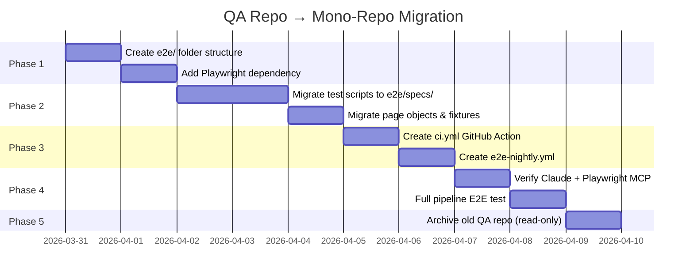

---

## 6. End-to-End Traceability Framework

### 6.1 The Traceability Chain

The goal is a complete, auditable chain from requirement to deployed code:

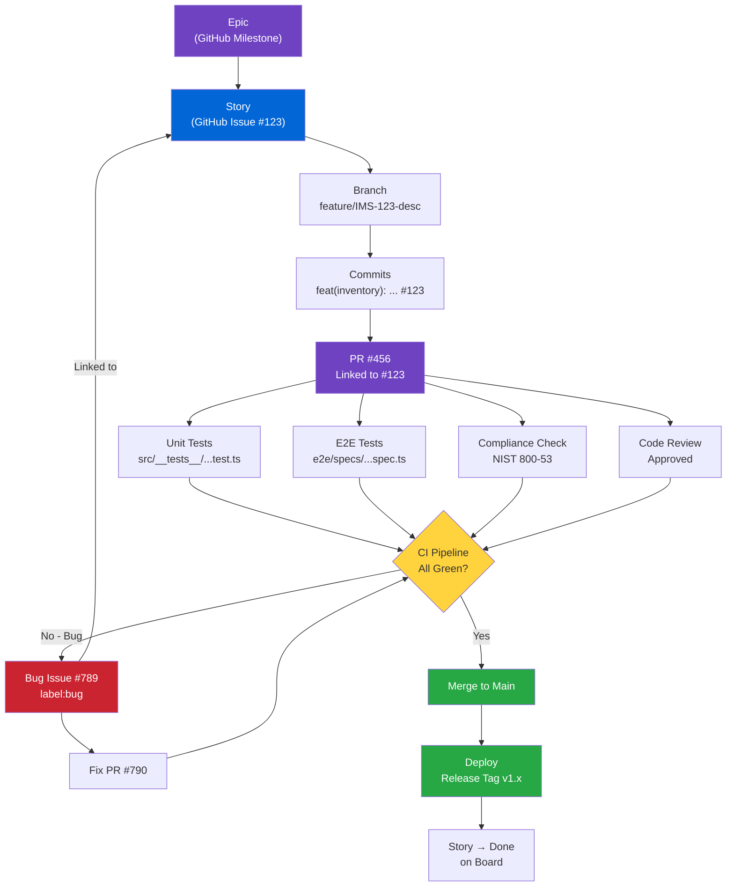

### 6.2 IMS Product Flow — Device Lifecycle Traceability

Beyond the *process flow* (story → code → deploy), management needs to see the **product flow** — how a device moves through the IMS system and how each lifecycle stage maps to traceable GitHub artifacts.

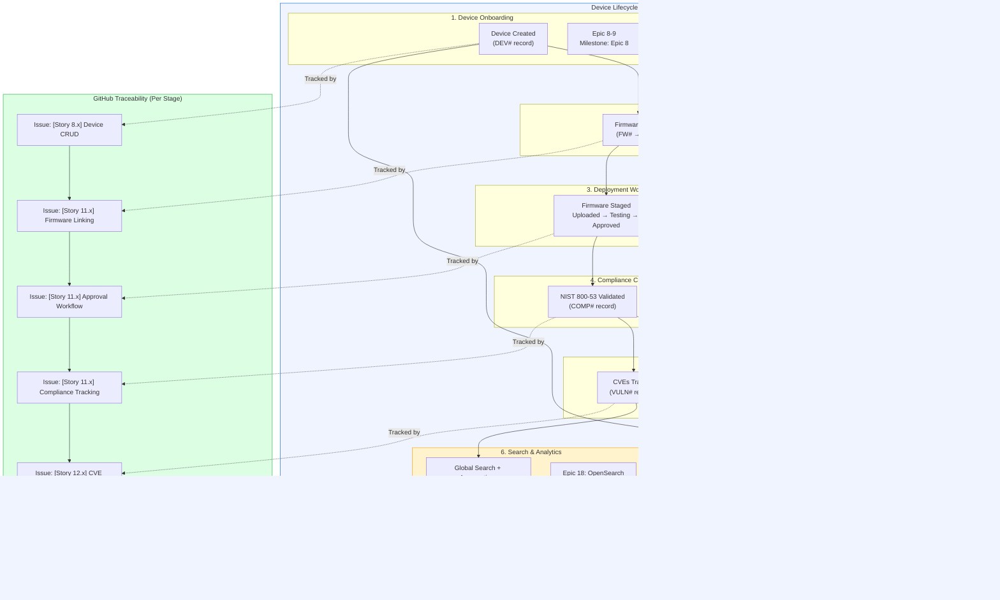

**What this gives management:** A single view showing that every product lifecycle stage has a corresponding GitHub Issue, Milestone, E2E test suite, and CI pipeline validation — complete end-to-end traceability from device onboarding to audit trail.

### 6.3 Naming Conventions (Critical for Traceability)

| Artifact | Convention | Example |
|----------|-----------|---------|
| **Epic** | GitHub Milestone: `Epic N: Title` | `Epic 10: Amazon Location Service` |
| **Story** | GitHub Issue: `[Story N.M] Title` | `[Story 10.5] Replace Static Map with Interactive Map` |
| **Bug** | GitHub Issue: `[Bug] Title` + label:bug | `[Bug] Map pins not rendering on Firefox` |
| **Branch** | `feature/IMS-{issue#}-short-desc` | `feature/IMS-123-interactive-map` |
| **Commit** | `type(scope): description #issue` | `feat(inventory): add map component #123` |
| **PR title** | `[Story N.M] Description` | `[Story 10.5] Replace static map with Amazon Location` |
| **E2E test** | `e2e/specs/{module}/{feature}.spec.ts` | `e2e/specs/inventory/interactive-map.spec.ts` |
| **Test tag** | `@story-10.5` annotation in test | Links test to story for report filtering |

### 6.4 How Linking Works in Practice

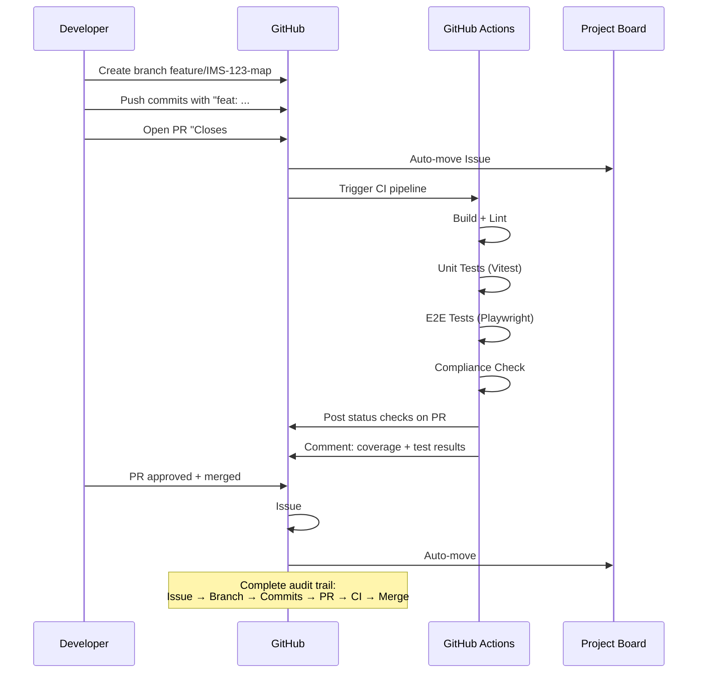

### 6.5 Automation Rules (GitHub Projects)

Set up these built-in automations:

| Trigger | Action |
|---------|--------|
| Issue added to project | Set status → Backlog |
| PR opened referencing issue | Move issue → In Review |
| PR merged | Move issue → In QA |
| All linked E2E tests pass | Move issue → Done |
| Issue labeled `bug` | Add to "Bugs" view |
| Issue closed | Move to Done, set sprint to current |

---

## 7. CI/CD Pipeline Design

### 7.1 Complete Pipeline Architecture

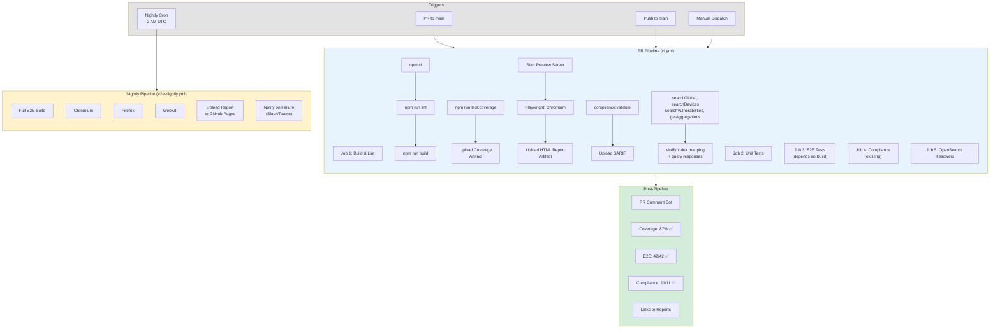

### 7.2 Pipeline Job Dependencies

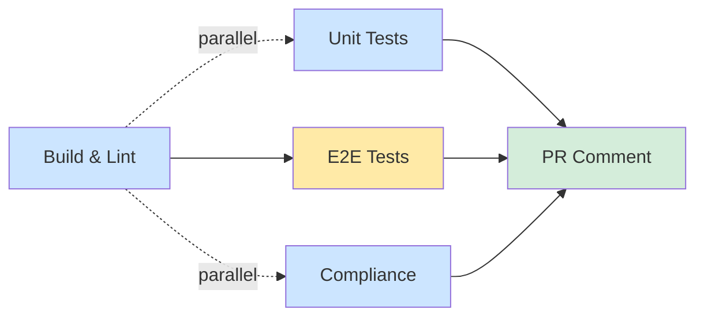

### 7.3 Test Reporting for Management

| Report | How | Frequency |
|--------|-----|-----------|
| **Sprint Board** | GitHub Projects Board view | Real-time |
| **Bug Count** | GitHub Projects filtered view + Insights chart | Real-time |
| **Test Results** | Playwright HTML report as GitHub Action artifact | Per PR + nightly |
| **Coverage Trend** | Vitest coverage in PR comments + artifact | Per PR |
| **Compliance** | SARIF in GitHub Code Scanning + JSON artifact | Per PR + on-demand |
| **Velocity** | GitHub Projects Insights → Items closed per sprint | Per sprint |
| **Client Report** | GitHub Projects public board + release notes | On demand |

---

## 8. Story-to-Bug Traceability (The Bug Loop)

### 8.1 Current Flow (Broken)

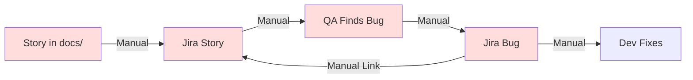

### 8.2 Proposed Flow (Automated)

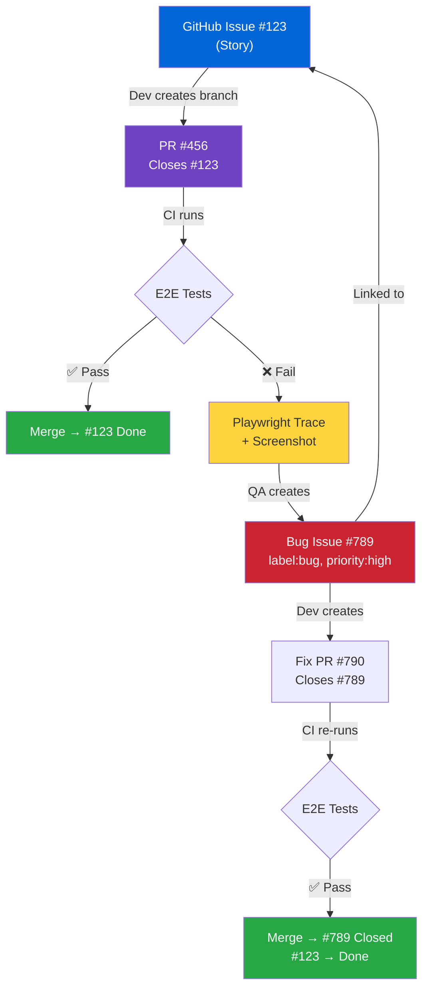

### 8.3 Claude + Playwright MCP Integration

The Claude + Playwright MCP workflow adapts cleanly to mono-repo:

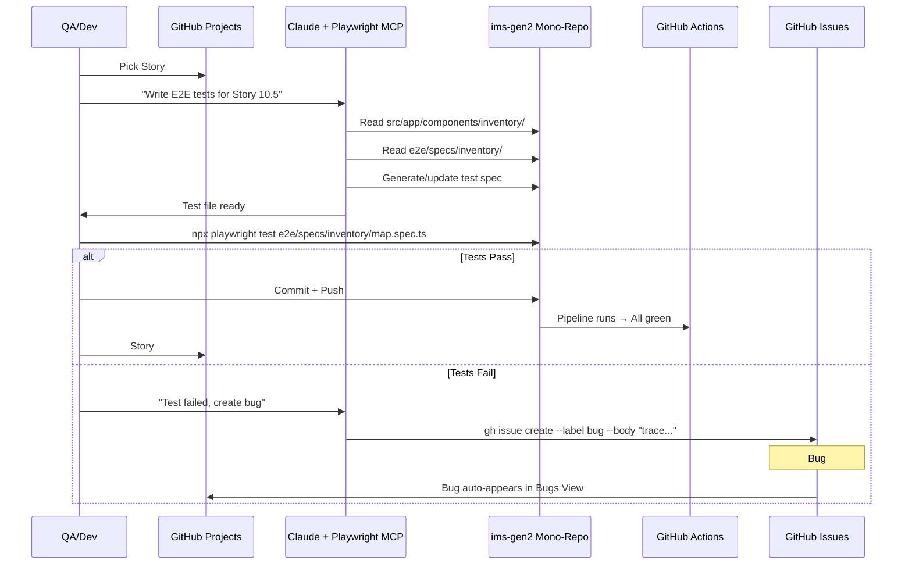

---

## 9. Claude as Project Command Center (MCP Integration)

This is the **differentiator**. Instead of switching between GitHub UI, CLI, IDE, and test runners — Claude becomes the single interface that orchestrates everything through MCP (Model Context Protocol) servers.

### 9.1 The Vision: Claude as the Hub

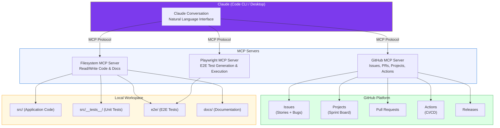

### 9.2 Current State vs Proposed MCP Stack

**Current:** You already have `atlassian-rovo` MCP configured in `.mcp.json` for Jira.

```json
// Current .mcp.json
{
  "mcpServers": {
    "atlassian-rovo": {
      "command": "npx",
      "args": ["-y", "mcp-remote", "https://mcp.atlassian.com/v1/mcp"]
    }
  }
}
```

**Proposed:** Replace/complement with GitHub MCP + Playwright MCP:

```json
// Proposed .mcp.json
{
  "mcpServers": {
    "github": {
      "command": "npx",
      "args": ["-y", "@modelcontextprotocol/server-github"],
      "env": {
        "GITHUB_PERSONAL_ACCESS_TOKEN": "<your-github-pat>"
      }
    },
    "playwright": {
      "command": "npx",
      "args": ["-y", "@playwright/mcp"]
    }
  }
}
```

> **Note:** Keep `atlassian-rovo` if you still need Jira during transition period. Remove it once fully migrated.

### 9.3 What Claude Can Do With GitHub MCP

```mermaid
mindmap
  root((Claude + GitHub MCP))
    Project Management
      Create/update Issues
      Move items on Sprint Board
      Assign stories to sprints
      Set priority, points, labels
      Query open bugs by epic
      Get sprint velocity stats
    Development
      Create feature branches
      Open Pull Requests
      Link PRs to Issues
      Review PR diffs
      Merge approved PRs
    QA & Testing
      Generate E2E test specs
      Run Playwright tests
      File bugs from test failures
      Attach traces to bug issues
      Update QA Status field
    Reporting
      Sprint status summary
      Bug count by severity
      Coverage trends
      Generate release notes
    CI/CD
      Trigger workflow runs
      Check pipeline status
      Download test artifacts
      Create releases with tags
```

### 9.4 MCP Server Capabilities — Detailed

#### GitHub MCP Server (`@modelcontextprotocol/server-github`)

| Capability | MCP Tool | What It Does |
|-----------|----------|-------------|
| **Create Issue** | `create_issue` | Create stories/bugs with labels, milestone, assignee |
| **Update Issue** | `update_issue` | Change status, add labels, assign to sprint |
| **Search Issues** | `search_issues` | Query: `repo:org/ims-gen2 label:bug is:open` |
| **List Issues** | `list_issues` | Filter by label, milestone, assignee, state |
| **Create PR** | `create_pull_request` | Open PR with title, body, linked issues |
| **Get PR** | `get_pull_request` | Read PR details, checks, reviews |
| **Merge PR** | `merge_pull_request` | Merge after checks pass |
| **Create Branch** | `create_branch` | `feature/IMS-123-desc` from main |
| **Create Release** | `create_release` | Tag + changelog generation |
| **Get File** | `get_file_contents` | Read any file from repo |
| **Push File** | `push_files` | Commit file changes directly |
| **List Workflows** | `list_workflow_runs` | Check CI/CD status |
| **Trigger Workflow** | `trigger_workflow` | Manually run CI pipeline |

#### Playwright MCP Server (`@playwright/mcp`)

| Capability | MCP Tool | What It Does |
|-----------|----------|-------------|
| **Navigate** | `playwright_navigate` | Open app URL in browser |
| **Screenshot** | `playwright_screenshot` | Capture current page state |
| **Click** | `playwright_click` | Interact with UI elements |
| **Fill** | `playwright_fill` | Type into form fields |
| **Evaluate** | `playwright_evaluate` | Run JS in browser context |
| **Assert** | Custom assertions | Verify UI state matches expected |

### 9.5 Claude-Powered Workflows (Natural Language)

This is where it gets powerful. Instead of context-switching between tools, you **talk to Claude** and it orchestrates everything:

#### Workflow 1: Sprint Planning

```mermaid
sequenceDiagram
    participant Dev as Developer
    participant Claude as Claude (with GitHub MCP)
    participant GH as GitHub Projects

    Dev->>Claude: "Set up Sprint 13. Pull stories 10.5, 10.6,<br/>11.1, 11.2 from backlog. Assign 10.5 to me,<br/>rest to the team. Each sprint is 2 weeks."

    Claude->>GH: Update Issue #45 (Story 10.5) → Sprint 13, Assignee: Gaurav
    Claude->>GH: Update Issue #46 (Story 10.6) → Sprint 13
    Claude->>GH: Update Issue #50 (Story 11.1) → Sprint 13
    Claude->>GH: Update Issue #51 (Story 11.2) → Sprint 13
    Claude->>Dev: "Done. Sprint 13 set up with 4 stories.<br/>Total points: 21. You're assigned Story 10.5 (8 pts)."
```

**What you say to Claude:**
> "Set up Sprint 13 starting April 7. Move stories 10.5, 10.6, 11.1, and 11.2 from backlog. Assign 10.5 to me, distribute the rest."

**What Claude does (via GitHub MCP):**
1. Updates each issue's `Sprint` iteration field → `Sprint 13`
2. Sets assignees
3. Moves items on the board from `Backlog` → `Sprint Ready`
4. Summarizes the sprint: story count, total points, assignments

---

#### Workflow 2: Story Implementation (Dev + QA in One Flow)

```mermaid
sequenceDiagram
    participant Dev as Developer
    participant Claude as Claude (GitHub + Playwright MCP)
    participant Repo as Local Repo
    participant GH as GitHub
    participant Browser as Browser (Playwright)

    Dev->>Claude: "Start work on Story 10.5 - Replace Static Map"

    Note over Claude: Step 1: Project Management
    Claude->>GH: Get Issue #45 details (ACs, description)
    Claude->>GH: Move #45 → "In Development"
    Claude->>Repo: git checkout -b feature/IMS-45-interactive-map

    Note over Claude: Step 2: Implementation
    Claude->>Repo: Read existing src/app/components/inventory/
    Claude->>Repo: Write new map component code
    Claude->>Repo: Write unit tests in src/__tests__/

    Note over Claude: Step 3: E2E Test Generation
    Claude->>Repo: Read acceptance criteria from Issue #45
    Claude->>Repo: Generate e2e/specs/inventory/interactive-map.spec.ts
    Claude->>Repo: Run: npx playwright test

    Note over Claude: Step 4: Visual Verification (Playwright MCP)
    Claude->>Browser: Navigate to /inventory → Geo Location tab
    Claude->>Browser: Screenshot: verify map renders
    Claude->>Browser: Click pins, verify tooltips
    Claude->>Dev: "Map renders correctly. All 5 ACs verified. Screenshot attached."

    Note over Claude: Step 5: PR & Traceability
    Claude->>Repo: git commit -m "feat(inventory): interactive map #45"
    Claude->>GH: Create PR "Closes #45" with AC checklist
    Claude->>GH: Move #45 → "In Review"
    Claude->>Dev: "PR #78 created, linked to Story 10.5, CI running."
```

**What you say to Claude:**
> "Start working on Story 10.5. Read the issue, create a branch, implement it, write E2E tests, verify it visually, and open a PR."

---

#### Workflow 3: QA Bug Discovery & Filing

```mermaid
sequenceDiagram
    participant QA as QA/Dev
    participant Claude as Claude (GitHub + Playwright MCP)
    participant Browser as Browser (Playwright)
    participant GH as GitHub Issues

    QA->>Claude: "Run E2E tests for the inventory map feature"

    Claude->>Browser: Navigate to /inventory
    Claude->>Browser: Click "Geo Location" tab
    Claude->>Browser: Verify map loads
    Claude->>Browser: Click device pin
    Browser-->>Claude: Error: Tooltip doesn't show device name

    Claude->>Browser: Take screenshot of failure
    Claude->>Browser: Capture console errors

    Claude->>QA: "Found a bug: Device tooltip shows 'undefined'<br/>instead of device name. Screenshot captured."

    QA->>Claude: "File it as a bug against Story 10.5"

    Claude->>GH: create_issue({
    Note over GH: Title: [Bug] Device tooltip shows undefined on map pin click
    Note over GH: Labels: bug, priority:high, module:inventory, epic:10
    Note over GH: Body: Parent Story: #45<br/>Steps to reproduce...<br/>Expected vs Actual...<br/>Screenshot attached
    Note over GH: Milestone: Epic 10: Amazon Location Service
    Claude->>GH: })

    Claude->>QA: "Bug #89 created, linked to Story #45,<br/>added to Sprint Board Bugs view."
```

**What you say to Claude:**
> "Test the inventory map. If anything fails, file a bug against Story 10.5."

---

#### Workflow 4: Sprint Status Report (For Management)

```mermaid
sequenceDiagram
    participant PM as Manager/PM
    participant Claude as Claude (GitHub MCP)
    participant GH as GitHub Projects

    PM->>Claude: "Give me the Sprint 12 status report"

    Claude->>GH: search_issues("repo:org/ims-gen2 project:1 iteration:Sprint 12")
    Claude->>GH: list_issues(label: "bug", state: "open")
    Claude->>GH: Get PR merge stats for sprint period

    Claude->>PM: Sprint 12 Status Report
    Note over PM: **Sprint 12 Status (March 17 - March 28)**<br/><br/>**Velocity:** 34 points completed (target: 40)<br/><br/>**Stories:**<br/>✅ Done: 10.1, 10.2, 10.3, 9.4 (26 pts)<br/>🔄 In Progress: 10.4 (8 pts)<br/>⏳ Not Started: 10.5 (8 pts) → carry to Sprint 13<br/><br/>**Bugs:**<br/>🔴 Open: 3 (1 critical, 2 medium)<br/>✅ Fixed this sprint: 5<br/><br/>**CI Health:**<br/>✅ 47/52 PR builds passed (90.4%)<br/>✅ Nightly E2E: 38/42 tests passing<br/><br/>**Risks:**<br/>⚠️ Story 10.5 blocked on AWS credentials config
```

**What you say to Claude:**
> "Generate a sprint status report for Sprint 12. Include velocity, story progress, bug count, and CI health."

---

#### Workflow 5: Release & Changelog

**What you say to Claude:**
> "Create release v1.3.0 from main. Include all merged PRs since v1.2.0 in the changelog."

**What Claude does:**
1. `search_issues` — finds all PRs merged since last release tag
2. Groups changes by type (features, fixes, chores)
3. `create_release` — creates GitHub Release with generated changelog
4. Tags the commit as `v1.3.0`

---

#### Workflow 6: Product Health + Sprint Report (OpenSearch + GitHub MCP)

This is the **differentiator** over standard project management. Instead of reporting *only* sprint metrics, Claude combines **GitHub Projects data** with **OpenSearch aggregations** to deliver a unified product health + project status report.

```mermaid
sequenceDiagram
    participant PM as Manager/PM
    participant Claude as Claude (GitHub + AppSync MCP)
    participant GH as GitHub Projects
    participant OS as OpenSearch (via AppSync)

    PM->>Claude: "Full sprint + product health report for Sprint 13"

    Note over Claude: Step 1: Project Metrics (GitHub MCP)
    Claude->>GH: search_issues("iteration:Sprint 13")
    Claude->>GH: list_issues(label: "bug", state: "open")
    Claude->>GH: Get PR merge stats

    Note over Claude: Step 2: Product Metrics (OpenSearch Aggregations)
    Claude->>OS: getAggregations(metric: "devicesByStatus")
    Claude->>OS: getAggregations(metric: "complianceByStatus")
    Claude->>OS: getAggregations(metric: "topVulnerabilities")
    Claude->>OS: getAggregations(metric: "deploymentTrend")

    Claude->>PM: Combined Report
    Note over PM: **Sprint 13 + Product Health Report**<br/><br/>**Sprint Velocity:** 38/40 points ✅<br/>Stories Done: 18.1, 18.2, 18.3 (search)<br/>Bugs: 2 open (0 critical)<br/><br/>**Platform Health (Live):**<br/>📊 Devices: 1,247 online / 43 offline / 12 maintenance<br/>🔒 Compliance: 94% approved, 3 pending review<br/>⚠️ Vulnerabilities: 2 critical, 5 high (OpenSSL)<br/>🚀 Deployments: 8 this week (↑23% vs last)<br/>🔍 Search: 342 queries/day, avg 120ms response<br/><br/>**Risk:** 2 critical CVEs unresolved > 7 days
```

**What you say to Claude:**
> "Give me Sprint 13 status including live platform health — device counts, compliance status, open vulnerabilities, and deployment trend."

**Why this matters:** No other tool does this. Jira gives project metrics. Grafana gives infra metrics. Claude + OpenSearch + GitHub MCP gives you **both in one report** — the project *and* the product it's building.

---

### 9.6 MCP Setup Instructions

#### Step 1: Generate GitHub Personal Access Token

1. Go to GitHub → **Settings** → **Developer settings** → **Personal access tokens** → **Fine-grained tokens**
2. Click **"Generate new token"**
3. Name: `claude-mcp-ims-gen2`
4. Expiration: 90 days (or custom)
5. Repository access: **Only select repositories** → `ims-gen2`
6. Permissions:
   - **Issues**: Read and write
   - **Pull requests**: Read and write
   - **Contents**: Read and write
   - **Projects**: Read and write
   - **Actions**: Read and write (for CI triggers)
   - **Metadata**: Read
7. Click **"Generate token"** → Copy the token

#### Step 2: Configure GitHub MCP for Claude Code (CLI)

Update `.mcp.json` in the project root:

```json
{
  "mcpServers": {
    "github": {
      "command": "npx",
      "args": ["-y", "@modelcontextprotocol/server-github"],
      "env": {
        "GITHUB_PERSONAL_ACCESS_TOKEN": "<paste-your-token-here>"
      }
    },
    "playwright": {
      "command": "npx",
      "args": ["-y", "@playwright/mcp"]
    }
  }
}
```

> **Security Note:** Never commit tokens to git. Use environment variables or a `.env` file that is gitignored. Alternatively, set the token in your shell profile:
> ```bash
> export GITHUB_PERSONAL_ACCESS_TOKEN="ghp_your_token_here"
> ```
> Then reference it in `.mcp.json`:
> ```json
> "env": {
>   "GITHUB_PERSONAL_ACCESS_TOKEN": "${GITHUB_PERSONAL_ACCESS_TOKEN}"
> }
> ```

#### Step 3: Configure for Claude Desktop (Optional)

Update `%APPDATA%\Claude\claude_desktop_config.json`:

```json
{
  "mcpServers": {
    "github": {
      "command": "npx",
      "args": ["-y", "@modelcontextprotocol/server-github"],
      "env": {
        "GITHUB_PERSONAL_ACCESS_TOKEN": "<your-token>"
      }
    },
    "playwright": {
      "command": "npx",
      "args": ["-y", "@playwright/mcp"]
    }
  }
}
```

#### Step 4: Verify MCP Connection

In Claude Code CLI:
```bash
# Start Claude Code in the project
claude

# Test GitHub MCP
> "List all open issues in this repo with label:story"

# Test Playwright MCP (if configured)
> "Open http://localhost:5173 in the browser and take a screenshot"
```

#### Step 5: Update `.gitignore` for Token Security

```
# MCP tokens (if stored locally)
.env
.env.local
*.token
```

### 9.7 Transition Plan: Atlassian Rovo → GitHub MCP

```mermaid
gantt
    title MCP Transition Timeline
    dateFormat  YYYY-MM-DD

    section Phase 1: Parallel Run
    Set up GitHub MCP alongside Rovo       :p1a, 2026-03-31, 2d
    Test GitHub MCP workflows              :p1b, after p1a, 3d
    Both MCPs active (Jira + GitHub)       :p1c, after p1b, 5d

    section Phase 2: Migration
    Import remaining Jira issues to GitHub :p2a, after p1c, 2d
    Switch team to GitHub-only workflow    :p2b, after p2a, 1d
    Verify all links preserved             :p2c, after p2b, 2d

    section Phase 3: Cleanup
    Remove atlassian-rovo from .mcp.json   :p3a, after p2c, 1d
    Archive Jira project (read-only)       :p3b, after p3a, 1d
    Add Playwright MCP for QA flow         :p3c, after p3b, 2d
```

**Current `.mcp.json`** (Jira only):
```json
{ "mcpServers": { "atlassian-rovo": { ... } } }
```

**Phase 1** (Both active — parallel run):
```json
{
  "mcpServers": {
    "atlassian-rovo": { "command": "npx", "args": ["-y", "mcp-remote", "https://mcp.atlassian.com/v1/mcp"] },
    "github": { "command": "npx", "args": ["-y", "@modelcontextprotocol/server-github"], "env": { "GITHUB_PERSONAL_ACCESS_TOKEN": "${GITHUB_PERSONAL_ACCESS_TOKEN}" } }
  }
}
```

**Phase 3** (GitHub only — final state):
```json
{
  "mcpServers": {
    "github": {
      "command": "npx",
      "args": ["-y", "@modelcontextprotocol/server-github"],
      "env": { "GITHUB_PERSONAL_ACCESS_TOKEN": "${GITHUB_PERSONAL_ACCESS_TOKEN}" }
    },
    "playwright": {
      "command": "npx",
      "args": ["-y", "@playwright/mcp"]
    }
  }
}
```

### 9.8 Claude Prompt Templates for Common Tasks

These are ready-to-use prompts your team can use daily:

#### Sprint Planning
```
Set up Sprint {N} starting {date}. Move these stories from backlog:
- Story {X.Y}: {title}
- Story {X.Y}: {title}
Assign {story} to {person}. Set all to "Sprint Ready".
```

#### Story Kickoff
```
I'm starting work on Story {X.Y} (Issue #{N}).
1. Read the issue and show me the acceptance criteria
2. Create branch feature/IMS-{N}-{short-desc}
3. Move the issue to "In Development"
4. Show me the relevant source files I'll need to modify
```

#### E2E Test Generation
```
Generate Playwright E2E tests for Story {X.Y} (Issue #{N}).
Read the acceptance criteria from the issue, then create tests in
e2e/specs/{module}/{feature}.spec.ts that cover every AC.
Use the page object from e2e/pages/{module}.page.ts.
```

#### Bug Filing
```
File a bug against Story {X.Y} (Issue #{N}):
- Title: {description}
- Severity: {Critical/High/Medium/Low}
- Steps to reproduce: {steps}
- Expected: {expected}
- Actual: {actual}
Label it as bug, priority:{level}, module:{module}, epic:{N}.
```

#### Sprint Status
```
Generate a sprint status report for Sprint {N}. Include:
- Stories completed vs planned (with points)
- Open bugs by severity
- CI pipeline health (last 5 runs)
- Any blocked items
- Carry-over stories for next sprint
Format it for management — keep it concise.
```

#### PR Creation
```
Create a PR for my current branch.
- Title: [Story {X.Y}] {description}
- Link to Issue #{N} with "Closes #{N}"
- List all changes in the description
- Add the test coverage summary
```

#### Release
```
Create release v{X.Y.Z} from main.
Include all changes since v{prev version}.
Group the changelog by: Features, Bug Fixes, Chores.
```

### 9.9 End-to-End Flow: Claude Orchestrating Everything

This diagram shows how a **single Claude conversation** can manage the entire lifecycle from story to deployment:

```mermaid
graph TD
    subgraph PLAN["1. Plan (Claude + GitHub MCP)"]
        P1["'Set up Sprint 13 with stories...'"] --> P2["Claude creates iterations,<br/>assigns issues, sets fields"]
    end

    subgraph DEV["2. Develop (Claude + Filesystem)"]
        D1["'Start Story 10.5'"] --> D2["Claude reads issue ACs,<br/>creates branch, writes code"]
    end

    subgraph TEST["3. Test (Claude + Playwright MCP)"]
        T1["'Write E2E tests for 10.5'"] --> T2["Claude generates Playwright specs,<br/>runs them, captures results"]
    end

    subgraph VERIFY["4. Verify (Claude + Playwright MCP)"]
        V1["'Visually check the map page'"] --> V2["Claude opens browser,<br/>screenshots, validates UI"]
    end

    subgraph SUBMIT["5. Submit (Claude + GitHub MCP)"]
        S1["'Open PR for Story 10.5'"] --> S2["Claude creates PR,<br/>links to issue, CI triggers"]
    end

    subgraph BUG["5b. Bug (Claude + GitHub MCP)"]
        B1["Test fails"] --> B2["Claude auto-files bug issue,<br/>links to story, attaches trace"]
    end

    subgraph REPORT["6. Report (Claude + GitHub MCP)"]
        R1["'Sprint 13 status report'"] --> R2["Claude queries project,<br/>generates formatted report"]
    end

    subgraph RELEASE["7. Release (Claude + GitHub MCP)"]
        RE1["'Create release v1.3.0'"] --> RE2["Claude tags, generates changelog,<br/>creates GitHub Release"]
    end

    PLAN --> DEV --> TEST --> VERIFY
    VERIFY -->|"Pass"| SUBMIT
    VERIFY -->|"Fail"| BUG
    BUG -->|"Fix"| DEV
    SUBMIT --> REPORT --> RELEASE

    style PLAN fill:#6f42c1,color:#fff
    style DEV fill:#0366d6,color:#fff
    style TEST fill:#e36209,color:#fff
    style VERIFY fill:#b08800,color:#fff
    style SUBMIT fill:#28a745,color:#fff
    style BUG fill:#cb2431,color:#fff
    style REPORT fill:#0366d6,color:#fff
    style RELEASE fill:#28a745,color:#fff
```

### 9.10 Why This Matters: The Multiplier Effect

| Without Claude MCP | With Claude MCP |
|-------------------|-----------------|
| Open GitHub UI → find issue → read ACs → switch to IDE → code → switch to terminal → test → switch to GitHub → create PR → fill form | **"Start Story 10.5"** → Claude does it all |
| Open browser → navigate → manually check UI → take screenshot → write up bug → open GitHub → create issue → fill template → link to story | **"Test the map page and file any bugs"** → Claude does it all |
| Open GitHub Projects → filter by sprint → count stories → count bugs → check CI → write email to management | **"Sprint 12 status report"** → Claude generates it |
| Context switches per task: **8-12** | Context switches per task: **1 (talk to Claude)** |
| Tools used: **4-5** (GitHub, IDE, Terminal, Browser, Jira) | Tools used: **1** (Claude) |

---

## 10. GitHub Actions: The Automated Enforcement Layer

### 10.1 Why GitHub Actions Matters (Even With Claude MCP)

A common question: *"If Claude can do everything via MCP, why do we need GitHub Actions?"*

The answer: **Claude is interactive. Actions is automatic.**

```mermaid
graph TD
    subgraph CLAUDE_DOMAIN["Claude + MCP (Interactive Layer)"]
        direction TB
        C1["Developer talks to Claude"]
        C2["Write code, generate tests"]
        C3["Create issues, open PRs"]
        C4["Sprint planning, status reports"]
        C5["Visual QA with Playwright MCP"]
        C1 --> C2 --> C3
        C1 --> C4
        C1 --> C5
    end

    subgraph ACTIONS_DOMAIN["GitHub Actions (Automation Layer)"]
        direction TB
        A1["Triggered automatically<br/>on push, PR, schedule, merge"]
        A2["Build verification"]
        A3["Unit + E2E test enforcement"]
        A4["Compliance validation"]
        A5["Quality gates (block merge)"]
        A6["Nightly regression"]
        A7["Report generation"]
        A8["Board automation"]
        A1 --> A2 --> A3 --> A4 --> A5
        A1 --> A6 --> A7
        A1 --> A8
    end

    CLAUDE_DOMAIN -->|"PR opened"| ACTIONS_DOMAIN
    ACTIONS_DOMAIN -->|"Results feed back<br/>to Claude & Board"| CLAUDE_DOMAIN

    style CLAUDE_DOMAIN fill:#7c3aed,color:#fff
    style ACTIONS_DOMAIN fill:#2088ff,color:#fff
```

**The critical distinction:**

| | Claude + MCP | GitHub Actions |
|---|-------------|----------------|
| **When it runs** | When a human asks | Automatically on events |
| **Who triggers it** | Developer in conversation | Git push, PR open, cron, merge |
| **Can it be skipped?** | Yes (human choice) | No (enforced by branch protection) |
| **Runs at 2 AM?** | No (needs human) | Yes (cron-scheduled nightly) |
| **Blocks bad code from merging?** | No (advisory) | **Yes (required status checks)** |
| **Scales to 10 PRs/day?** | Only if someone talks to Claude for each | Runs on every PR automatically |
| **Produces audit trail?** | Conversation logs | **Immutable run logs, artifacts, SARIF reports** |

### 10.2 What Breaks Without GitHub Actions

Imagine this scenario **without** Actions:

```mermaid
flowchart TD
    DEV1["Dev A opens PR #1<br/>Tests pass locally"] --> MERGE1["Merges to main ✅"]
    DEV2["Dev B opens PR #2<br/>Forgot to run tests"] --> MERGE2["Merges to main ✅"]
    MERGE1 --> MAIN["main branch"]
    MERGE2 --> MAIN
    MAIN --> BROKEN["💥 Production broken<br/>Dev B's code had a bug<br/>Nobody caught it"]

    style BROKEN fill:#cb2431,color:#fff
    style MERGE2 fill:#ffd33d
```

Now **with** Actions as the gatekeeper:

```mermaid
flowchart TD
    DEV1["Dev A opens PR #1"] --> CI1{"GitHub Actions CI"}
    DEV2["Dev B opens PR #2<br/>(has a bug)"] --> CI2{"GitHub Actions CI"}

    CI1 -->|"Build ✅ Tests ✅<br/>Compliance ✅"| MERGE1["Merge allowed ✅"]
    CI2 -->|"Build ✅ Tests ❌<br/>E2E fails!"| BLOCK["❌ Merge BLOCKED<br/>Must fix first"]

    MERGE1 --> MAIN["main branch<br/>Always healthy"]
    BLOCK -->|"Dev B fixes bug"| CI3{"Re-run CI"}
    CI3 -->|"All green ✅"| MERGE2["Now merge allowed ✅"]
    MERGE2 --> MAIN

    style MAIN fill:#28a745,color:#fff
    style BLOCK fill:#cb2431,color:#fff
    style CI1 fill:#2088ff,color:#fff
    style CI2 fill:#2088ff,color:#fff
```

**GitHub Actions is the safety net that catches what humans forget.**

### 10.3 The 7 Roles of GitHub Actions in This Strategy

```mermaid
mindmap
  root((GitHub Actions<br/>7 Roles))
    1. Quality Gate
      Block PR merge if tests fail
      Required status checks
      Branch protection rules
      No human can bypass
    2. CI Pipeline
      Build verification
      Unit tests (Vitest)
      E2E tests (Playwright)
      Lint checks
    3. Compliance Enforcement
      NIST 800-53 validation
      SARIF upload to Code Scanning
      Compliance report artifacts
      Already running today
    4. Nightly Regression
      Full E2E suite at 2 AM
      All browsers: Chrome, Firefox, WebKit
      Auto-file bug issue on failure
      Trend detection over time
    5. Reporting Engine
      PR comment bot with results
      Test report artifacts (30-day retention)
      Coverage reports
      Downloadable Playwright HTML reports
    6. Board Automation
      Auto-move issues on PR events
      Label management
      Sprint field updates
      Extends GitHub Projects built-in workflows
    7. Release Pipeline
      Tag-triggered releases
      Auto-generated changelogs
      Build + deploy artifacts
      Deployment verification
```

### 10.4 Detailed: Each Role Explained

#### Role 1: Quality Gate (Most Important)

This is the **#1 reason** you need Actions. Without it, anyone can merge broken code.

**Setup: Branch Protection Rules**

```
Repository Settings → Branches → Branch protection rule → main
  ✅ Require a pull request before merging
  ✅ Require status checks to pass before merging
      Required checks:
        ✅ build (Build & Lint)
        ✅ unit-tests (Unit & Integration Tests)
        ✅ e2e-tests (E2E Tests - Playwright)
        ✅ compliance (Compliance Validation)
  ✅ Require branches to be up to date before merging
  ✅ Require conversation resolution before merging
```

**What this means:** Even if Claude MCP opens the PR, it **cannot merge** until Actions gives the green light. This is non-negotiable quality enforcement.

```mermaid
sequenceDiagram
    participant Dev as Developer
    participant Claude as Claude MCP
    participant GH as GitHub
    participant CI as GitHub Actions
    participant Board as Sprint Board

    Dev->>Claude: "Open PR for Story 10.5"
    Claude->>GH: Create PR #78 (Closes #45)

    GH->>CI: Auto-trigger ci.yml
    Note over CI: Running 4 parallel jobs...

    CI->>CI: Job 1: Build & Lint ✅
    CI->>CI: Job 2: Unit Tests (87% coverage) ✅
    CI->>CI: Job 3: E2E Tests (42/42) ✅
    CI->>CI: Job 4: Compliance (11/11 NIST) ✅

    CI->>GH: All status checks passed ✅
    CI->>GH: Post PR comment with summary

    GH->>GH: "Merge" button now enabled
    Dev->>GH: Approve + Merge
    GH->>Board: Issue #45 → Done

    Note over GH,CI: Without Actions: Dev could merge<br/>broken code. With Actions: impossible.
```

#### Role 2: CI Pipeline (Per-PR)

Runs on **every PR** and **every push to main** — no exceptions:

```mermaid
graph LR
    subgraph TRIGGER["Trigger: PR opened / Push to main"]
        PR["PR / Push"]
    end

    subgraph PARALLEL["Jobs (Parallel)"]
        B["Build & Lint<br/>~1 min"]
        U["Unit Tests<br/>~2 min"]
        C["Compliance<br/>~1 min"]
    end

    subgraph SEQUENTIAL["Job (Sequential)"]
        E["E2E Tests<br/>(needs build)<br/>~5 min"]
    end

    subgraph OUTPUT["Outputs"]
        O1["PR Status Checks<br/>✅ or ❌"]
        O2["PR Comment<br/>Coverage + Results"]
        O3["Artifacts<br/>Reports (30 days)"]
        O4["SARIF<br/>Code Scanning"]
    end

    PR --> B & U & C
    B --> E
    B & U & C & E --> O1 & O2 & O3 & O4

    style TRIGGER fill:#e3e3e3
    style PARALLEL fill:#cce5ff
    style SEQUENTIAL fill:#ffeaa7
    style OUTPUT fill:#d4edda
```

**Total pipeline time: ~5-7 minutes** (parallel jobs cut this significantly)

#### Role 3: Compliance Enforcement (NIST 800-53)

You already have this running today (`compliance-check.yml`). This is **critical for your FedRAMP audit trail**:

```mermaid
graph TD
    subgraph COMPLIANCE["Compliance Pipeline (Existing)"]
        V1["Cognito Validator<br/>MFA, Password Policy"] --> R["Report Generator"]
        V2["S3 Validator<br/>Encryption, WORM"] --> R
        V3["DynamoDB Validator<br/>Encryption, PITR"] --> R
        V4["IAM Validator<br/>Role Policies"] --> R
        V5["Lambda Validator<br/>Execution Roles"] --> R
        V6["AppSync Validator<br/>Auth, Encryption"] --> R
        V7["CloudWatch Validator<br/>Logging Config"] --> R
    end

    R --> SARIF["SARIF Report<br/>→ GitHub Code Scanning"]
    R --> JSON["JSON Report<br/>→ Artifact (90 days)"]
    R --> CHECK["Status Check<br/>→ Block PR if fails"]

    style COMPLIANCE fill:#fff3cd
    style SARIF fill:#d4edda
    style CHECK fill:#d4edda
```

**Why this can't be Claude-only:** Compliance validation must run on **every single PR** consistently, with immutable logs. You can't rely on someone remembering to ask Claude. Actions guarantees it.

#### Role 4: Nightly Regression

Catches bugs that slip through PR-level testing:

```mermaid
graph TD
    subgraph NIGHTLY["Nightly at 2 AM UTC"]
        CRON["Cron Trigger<br/>0 2 * * *"]
    end

    CRON --> CHROME["Chromium<br/>Full Suite"]
    CRON --> FF["Firefox<br/>Full Suite"]
    CRON --> WK["WebKit<br/>Full Suite"]

    CHROME --> REPORT["Combined Report"]
    FF --> REPORT
    WK --> REPORT

    REPORT --> PASS{All Pass?}
    PASS -->|"Yes"| ARTIFACT["Upload Report<br/>Artifact"]
    PASS -->|"No"| BUG["Auto-create<br/>Bug Issue"]
    BUG --> LABEL["Labels: bug,<br/>nightly-failure"]
    BUG --> BOARD["Appears on<br/>Bugs View"]

    style NIGHTLY fill:#2088ff,color:#fff
    style BUG fill:#cb2431,color:#fff
    style ARTIFACT fill:#d4edda
```

**Why this matters:**
- Tests on PR only run Chromium (for speed)
- Nightly runs **all 3 browsers** — catches Firefox/Safari-only bugs
- Runs against `main` — catches integration bugs between merged PRs
- **Auto-files bugs** — nobody needs to manually check

#### Role 5: PR Reporting Engine

Every PR gets an automatic comment with results:

```
## CI Results

| Check           | Status     | Details                     |
|-----------------|------------|-----------------------------|
| Build & Lint    | ✅ Passed  | 0 warnings                  |
| Unit Tests      | ✅ Passed  | 142/142 (87.3% coverage)    |
| E2E Tests       | ✅ Passed  | 42/42 (Chromium)            |
| Compliance      | ✅ Passed  | 11/11 NIST 800-53 controls  |

📊 [Coverage Report](link-to-artifact)
🎭 [Playwright Report](link-to-artifact)
📋 [Compliance Report](link-to-artifact)
```

**This is what management sees on every PR** — proof that quality gates passed.

#### Role 6: Board Automation

GitHub Actions can do **project automation** beyond what built-in workflows support:

```mermaid
flowchart LR
    subgraph BUILTIN["Built-in Automations<br/>(GitHub Projects)"]
        B1["Issue closed → Done"]
        B2["Item added → Backlog"]
    end

    subgraph ACTIONS_AUTO["Actions-Powered Automations<br/>(Custom Workflows)"]
        A1["PR opened → Issue moves to 'In Review'"]
        A2["PR merged → Issue moves to 'In QA'"]
        A3["All E2E pass → Issue moves to 'Done'"]
        A4["Nightly fail → Create bug + add to 'Bugs' view"]
        A5["Label 'priority:critical' → Notify team via Slack"]
    end

    style BUILTIN fill:#e8f4fd
    style ACTIONS_AUTO fill:#d4edda
```

#### Role 7: Release Pipeline

```mermaid
sequenceDiagram
    participant Dev as Developer
    participant Claude as Claude MCP
    participant GH as GitHub
    participant CI as GitHub Actions

    Dev->>Claude: "Create release v1.3.0"
    Claude->>GH: Create tag v1.3.0 on main
    GH->>CI: Tag triggers release.yml

    CI->>CI: Build production bundle
    CI->>CI: Run full test suite (final check)
    CI->>CI: Generate changelog from PRs
    CI->>GH: Create GitHub Release
    Note over GH: v1.3.0 Release<br/>- feat: Interactive map (#78)<br/>- fix: Tooltip bug (#90)<br/>- chore: Upgrade deps (#92)
    CI->>GH: Upload build artifacts

    Note over CI: Claude creates the tag.<br/>Actions handles the release process.
```

### 10.5 How Claude MCP and GitHub Actions Work Together

```mermaid
graph TD
    subgraph DAILY_FLOW["Complete Daily Flow"]
        H1["Developer starts day"] --> H2["Talks to Claude:<br/>'Start Story 10.5'"]

        subgraph CLAUDE_WORK["Claude Does (Interactive)"]
            H2 --> CW1["Reads issue from GitHub"]
            CW1 --> CW2["Creates branch"]
            CW2 --> CW3["Writes code + tests"]
            CW3 --> CW4["Runs tests locally"]
            CW4 --> CW5["Opens PR via GitHub MCP"]
        end

        subgraph ACTIONS_WORK["Actions Does (Automatic)"]
            CW5 -->|"PR triggers"| AW1["ci.yml runs automatically"]
            AW1 --> AW2["Build ✅"]
            AW2 --> AW3["Unit Tests ✅"]
            AW2 --> AW4["E2E Tests ✅"]
            AW2 --> AW5["Compliance ✅"]
            AW3 & AW4 & AW5 --> AW6["PR Comment with results"]
            AW6 --> AW7["Status checks: All Green"]
        end

        AW7 --> H3["Developer reviews PR"]
        H3 --> H4["Merges PR"]

        subgraph ACTIONS_POST["Actions Does (Post-Merge)"]
            H4 -->|"Merge triggers"| AP1["Board: Issue → Done"]
            AP1 --> AP2["Deploy (if configured)"]
        end

        subgraph NIGHTLY["Actions Does (Overnight)"]
            N1["2 AM: Full regression"]
            N1 --> N2{Pass?}
            N2 -->|"Fail"| N3["Auto-create Bug Issue"]
            N2 -->|"Pass"| N4["Upload report artifact"]
        end
    end

    style CLAUDE_WORK fill:#7c3aed,color:#fff
    style ACTIONS_WORK fill:#2088ff,color:#fff
    style ACTIONS_POST fill:#2088ff,color:#fff
    style NIGHTLY fill:#0d47a1,color:#fff
```

### 10.6 Summary: The Division of Labor

| Task | Claude MCP | GitHub Actions | Why This Split |
|------|:----------:|:--------------:|----------------|
| Sprint planning | **Yes** | - | Interactive, needs human judgment |
| Write code | **Yes** | - | Creative work, needs context |
| Generate E2E tests | **Yes** | - | Needs understanding of ACs |
| Visual QA (browser) | **Yes** | - | Needs Playwright MCP + human review |
| Create Issues/PRs | **Yes** | - | Context-aware, natural language |
| Status reports | **Yes** | - | Needs aggregation + formatting |
| **Build verification** | - | **Yes** | Must run on EVERY PR, no exceptions |
| **Test enforcement** | - | **Yes** | Quality gate — blocks bad merges |
| **Compliance checks** | - | **Yes** | Audit trail, immutable logs |
| **Nightly regression** | - | **Yes** | Runs at 2 AM, nobody is awake |
| **PR result comments** | - | **Yes** | Automatic, consistent formatting |
| **Board automation** | - | **Yes** | Event-driven, no human needed |
| **Release pipeline** | - | **Yes** | Build + tag + changelog automation |
| Bug filing from test failure | **Both** | **Both** | Claude: interactive. Actions: nightly auto-file |

**One sentence:** Claude is the **brain** (interactive, creative, context-aware). Actions is the **immune system** (automatic, enforced, never sleeps).

---

## 11. Implementation Roadmap

### 11.1 Timeline Overview

```mermaid
gantt
    title Implementation Roadmap (4 Weeks)
    dateFormat  YYYY-MM-DD

    section Phase 0: MCP Setup
    Generate GitHub PAT              :p0a, 2026-03-31, 1d
    Configure GitHub MCP server      :p0b, after p0a, 1d
    Configure Playwright MCP         :p0c, after p0a, 1d
    Verify MCP connections           :p0d, after p0b, 1d

    section Phase 1: GitHub Projects
    Create Project + Fields          :p1a, after p0d, 1d
    Create Board Views               :p1b, after p1a, 1d
    Set Up Automations               :p1c, after p1b, 1d
    Create Milestones (Epics 8-17)   :p1d, after p1c, 1d
    Import Stories as Issues         :p1e, after p1d, 1d
    Create Issue Templates           :p1f, after p1e, 1d

    section Phase 2: Mono-Repo
    Create e2e/ folder structure     :p2a, 2026-04-09, 1d
    Add Playwright dependency        :p2b, after p2a, 1d
    Migrate test scripts             :p2c, after p2b, 2d
    Migrate page objects + fixtures  :p2d, after p2c, 1d
    Verify Claude + Playwright MCP   :p2e, after p2d, 1d

    section Phase 3: CI/CD
    Create ci.yml workflow           :p3a, 2026-04-16, 1d
    Create e2e-nightly.yml           :p3b, after p3a, 1d
    PR comment bot setup             :p3c, after p3b, 1d
    Full pipeline E2E validation     :p3d, after p3c, 1d

    section Phase 4: Polish & Transition
    GitHub Insights setup            :p4a, 2026-04-21, 1d
    Client-facing view               :p4b, after p4a, 1d
    Remove Jira MCP, archive Jira    :p4c, after p4b, 1d
    Naming convention docs           :p4d, after p4c, 1d
    Management demo                  :milestone, after p4d, 0d
    Archive QA repo                  :p4e, after p4d, 1d
```

### 11.2 Phase Details

#### Phase 0: Claude MCP Setup (Day 1-2)

| # | Task | Owner | Effort |
|---|------|-------|--------|
| 0.1 | Generate GitHub Fine-grained PAT with required permissions | Gaurav | 30 min |
| 0.2 | Install & configure `@modelcontextprotocol/server-github` in `.mcp.json` | Gaurav | 30 min |
| 0.3 | Install & configure `@playwright/mcp` in `.mcp.json` | Gaurav | 30 min |
| 0.4 | Test: "List all open issues in ims-gen2" via Claude | Gaurav | 15 min |
| 0.5 | Test: "Open localhost:5173 and take a screenshot" via Claude | Gaurav | 15 min |
| 0.6 | Keep `atlassian-rovo` active for parallel run during migration | Gaurav | - |

#### Phase 1: GitHub Projects Setup (Week 1)

| # | Task | Owner | Effort |
|---|------|-------|--------|
| 1.1 | Create GitHub Project "IMS Gen2 HLM Platform" | Gaurav | 1 hr |
| 1.2 | Configure custom fields (Sprint, Epic, Points, Priority, Type, QA Status) | Gaurav | 1 hr |
| 1.3 | Create board views (Sprint Board, Bugs, Current Sprint, Roadmap) | Gaurav | 2 hr |
| 1.4 | Set up automation rules (PR → In Review, merge → QA, close → Done) | Gaurav | 1 hr |
| 1.5 | Create Milestones for Epics 8-17 | Gaurav | 1 hr |
| 1.6 | Import existing stories from `docs/plans/epic-*-jira-stories.md` as GitHub Issues | Gaurav | 2 hr |
| 1.7 | Create Issue templates (Story, Bug, Spike) | Gaurav | 1 hr |

#### Phase 2: Mono-Repo Consolidation (Week 1-2)

| # | Task | Owner | Effort |
|---|------|-------|--------|
| 2.1 | Create `e2e/` folder structure in ims-gen2 | Gaurav | 0.5 day |
| 2.2 | Add Playwright as dev dependency, create `playwright.config.ts` | Gaurav | 0.5 day |
| 2.3 | Migrate test scripts from QA repo to `e2e/specs/` | Gaurav | 1 day |
| 2.4 | Migrate page objects and fixtures | Gaurav | 0.5 day |
| 2.5 | Verify Claude + Playwright MCP works from `e2e/` | Gaurav | 0.5 day |
| 2.6 | Add npm scripts: `test:e2e`, `test:e2e:headed`, `test:e2e:report` | Gaurav | 0.5 hr |
| 2.7 | Archive old QA repo (set to read-only) | Gaurav | 0.5 hr |

#### Phase 3: CI/CD Integration (Week 2)

| # | Task | Owner | Effort |
|---|------|-------|--------|
| 3.1 | Create `.github/workflows/ci.yml` (build + unit + e2e) | Gaurav | 0.5 day |
| 3.2 | Create `.github/workflows/e2e-nightly.yml` | Gaurav | 0.5 day |
| 3.3 | Configure Playwright GitHub Action with artifact upload | Gaurav | 0.5 day |
| 3.4 | Add PR comment bot for test/coverage summary | Gaurav | 0.5 day |
| 3.5 | Test full pipeline end-to-end | Gaurav | 0.5 day |

#### Phase 4: Traceability & Reporting Polish (Week 3)

| # | Task | Owner | Effort |
|---|------|-------|--------|
| 4.1 | Create GitHub Issue templates with traceability fields | Gaurav | 0.5 day |
| 4.2 | Document naming conventions in `CONTRIBUTING.md` | Gaurav | 0.5 day |
| 4.3 | Set up GitHub Projects Insights charts for management | Gaurav | 0.5 day |
| 4.4 | Create client-facing read-only project view | Gaurav | 0.5 day |
| 4.5 | Demo to management, gather feedback | Gaurav | 1 hr |

---

## 12. Step-by-Step Setup Guide

This section provides **exact, clickable instructions** for every team member.

---

### 12.1 GitHub Projects Setup

#### Step 1: Create the Project

1. Go to your GitHub organization or user profile
2. Click **"Projects"** tab → **"New project"**
3. Select **"Board"** template
4. Name it: **`IMS Gen2 HLM Platform`**
5. Click **"Create project"**

#### Step 2: Configure Custom Fields

From the Project view, click **"+"** (add field) for each:

| Field Name | Type | Options |
|-----------|------|---------|
| `Sprint` | **Iteration** | Click "Edit" → Add iterations: `Sprint 1 (2 weeks)`, `Sprint 2`, etc. |
| `Epic` | **Single select** | `Epic 8: Dashboard`, `Epic 9: Geo-Location`, `Epic 10: Location Service`, `Epic 11: Aegis Security`, `Epic 12: SBOM`, `Epic 13: Heatmaps`, `Epic 14: Incident Isolation`, `Epic 15: Digital Twin`, `Epic 16: Theme + KPI`, `Epic 17: Terraform Hybrid`, `Epic 18: OpenSearch & Global Search` |
| `Story Points` | **Number** | (no options needed) |
| `Priority` | **Single select** | `Critical`, `High`, `Medium`, `Low` |
| `Type` | **Single select** | `Story`, `Bug`, `Task`, `Spike` |
| `QA Status` | **Single select** | `Not Started`, `Tests Written`, `Passing`, `Failing` |

#### Step 3: Create Board Views

**View 1: Sprint Board (Default)**
1. Click current view name → **"Rename"** → `Sprint Board`
2. Layout: **Board**
3. Column field: **Status**
4. Add columns: `Backlog`, `Sprint Ready`, `In Development`, `In Review`, `In QA`, `Done`, `Blocked`
5. Filter: `iteration:@current` (to show only current sprint)

**View 2: Bugs**
1. Click **"New view"** → Name: `Bugs`
2. Layout: **Table**
3. Filter: `label:bug`
4. Sort by: Priority (descending)
5. Group by: Status

**View 3: Current Sprint (Table)**
1. Click **"New view"** → Name: `Current Sprint`
2. Layout: **Table**
3. Filter: `iteration:@current`
4. Group by: Assignee
5. Show columns: Title, Status, Priority, Story Points, QA Status

**View 4: Roadmap**
1. Click **"New view"** → Name: `Roadmap`
2. Layout: **Roadmap**
3. Date field: Use Sprint iteration dates
4. Group by: Epic

**View 5: Client Dashboard**
1. Click **"New view"** → Name: `Client Dashboard`
2. Layout: **Board**
3. Column field: Status
4. Columns: `In Progress`, `Done` (simplified)
5. Group by: Epic

#### Step 4: Set Up Automations

1. Click **"..."** (three dots) menu → **"Workflows"**
2. Enable these built-in workflows:

| Workflow | Configuration |
|----------|--------------|
| **Item added to project** | Set `Status` → `Backlog` |
| **Item closed** | Set `Status` → `Done` |
| **Pull request merged** | Set `Status` → `In QA` |
| **Auto-add to project** | Enable for repo `ims-gen2` → all new issues auto-added |

For advanced automations (PR opened → In Review), use **GitHub Actions**:

```yaml
# .github/workflows/project-automation.yml
name: Project Automation
on:
  pull_request:
    types: [opened, reopened]

jobs:
  move-to-review:
    runs-on: ubuntu-latest
    steps:
      - uses: actions/github-script@v7
        with:
          script: |
            // Extract issue numbers from PR body (e.g., "Closes #123")
            const body = context.payload.pull_request.body || '';
            const issueRefs = body.match(/#(\d+)/g) || [];
            console.log(`Found issue references: ${issueRefs}`);
            // GitHub Projects V2 API would update status here
```

#### Step 5: Create Milestones (Epics)

1. Go to repo → **"Issues"** → **"Milestones"** → **"New Milestone"**
2. Create one per epic:

| Milestone | Title | Description |
|-----------|-------|-------------|
| 1 | `Epic 8: Dashboard` | Dashboard module live API integration |
| 2 | `Epic 9: Geo-Location` | Geo-location formalization & improvement |
| 3 | `Epic 10: Amazon Location Service` | Interactive maps, geocoding & geofencing |
| 4 | `Epic 11: Aegis Phase 1` | Security framework implementation |
| 5 | `Epic 12: SBOM & Supply Chain` | Supply chain security |
| 6 | `Epic 13: Heatmaps & Blast Radius` | Heatmap visualization |
| 7 | `Epic 14: Incident Isolation` | Incident response & lateral movement |
| 8 | `Epic 15: Digital Twin` | Digital twin implementation |
| 9 | `Epic 16: Theme + KPI` | Dual theme switching + connectivity KPIs |
| 10 | `Epic 17: Terraform Hybrid` | Amplify + Terraform hybrid IaC |
| 11 | `Epic 18: OpenSearch & Global Search` | Full-text search, aggregations, geo queries |

#### Step 6: Import Stories as Issues

Use the `gh` CLI to bulk-create issues from your existing story docs:

```bash
# Example: Create a story issue
gh issue create \
  --title "[Story 10.1] Provision Amazon Location Service Resources" \
  --label "story,epic:10,priority:high" \
  --milestone "Epic 10: Amazon Location Service" \
  --body "## User Story
As a platform administrator, I want the Amazon Location Service resources
provisioned as part of the platform's cloud infrastructure.

## Acceptance Criteria
- [ ] Map resource created (VectorEsriNavigation style)
- [ ] Place Index created for geocoding
- [ ] API key generated and stored in Amplify config
- [ ] IAM permissions configured for authenticated users

## E2E Test Coverage
- [ ] Test file: e2e/specs/inventory/location-service-infra.spec.ts

## Definition of Done
- [ ] Code reviewed and approved
- [ ] Unit tests passing (>=85% coverage)
- [ ] E2E tests passing
- [ ] Compliance check green"
```

**Bulk import script** (create all stories at once):

```bash
#!/bin/bash
# scripts/import-stories.sh
# Run: bash scripts/import-stories.sh

REPO="your-org/ims-gen2"

# Epic 10 Stories
gh issue create --repo $REPO \
  --title "[Story 10.1] Provision Amazon Location Service Resources" \
  --label "story,epic:10" \
  --milestone "Epic 10: Amazon Location Service"

gh issue create --repo $REPO \
  --title "[Story 10.2] Configure IAM & Cognito Permissions" \
  --label "story,epic:10" \
  --milestone "Epic 10: Amazon Location Service"

gh issue create --repo $REPO \
  --title "[Story 10.3] Create Frontend Config Module" \
  --label "story,epic:10" \
  --milestone "Epic 10: Amazon Location Service"

# ... add more stories as needed
echo "All stories imported!"
```

#### Step 7: Create Issue Templates

Create these files in the repo:

**`.github/ISSUE_TEMPLATE/story.yml`**:
```yaml
name: User Story
description: A user story for sprint planning
labels: ["story"]
body:
  - type: dropdown
    id: epic
    attributes:
      label: Epic
      options:
        - "Epic 8: Dashboard"
        - "Epic 9: Geo-Location"
        - "Epic 10: Amazon Location Service"
        - "Epic 11: Aegis Security"
        - "Epic 12: SBOM"
        - "Epic 13: Heatmaps"
        - "Epic 14: Incident Isolation"
        - "Epic 15: Digital Twin"
        - "Epic 16: Theme + KPI"
        - "Epic 17: Terraform Hybrid"
        - "Epic 18: OpenSearch & Global Search"
    validations:
      required: true
  - type: input
    id: story-id
    attributes:
      label: Story ID
      placeholder: "e.g., 10.5"
    validations:
      required: true
  - type: input
    id: points
    attributes:
      label: Story Points
      placeholder: "1, 2, 3, 5, 8, 13"
  - type: textarea
    id: user-story
    attributes:
      label: User Story
      value: "As a [role], I want [goal], so that [benefit]."
    validations:
      required: true
  - type: textarea
    id: acceptance-criteria
    attributes:
      label: Acceptance Criteria
      value: |
        - [ ] AC1:
        - [ ] AC2:
        - [ ] AC3:
    validations:
      required: true
  - type: textarea
    id: e2e-coverage
    attributes:
      label: E2E Test Coverage
      value: |
        - [ ] Test file: `e2e/specs/{module}/{feature}.spec.ts`
        - [ ] All ACs have corresponding test assertions
  - type: textarea
    id: dod
    attributes:
      label: Definition of Done
      value: |
        - [ ] Code reviewed and approved
        - [ ] Unit tests passing (>=85% coverage)
        - [ ] E2E tests passing
        - [ ] Compliance check green
        - [ ] Documentation updated (if applicable)
```

**`.github/ISSUE_TEMPLATE/bug.yml`**:
```yaml
name: Bug Report
description: Report a defect found during QA
labels: ["bug"]
body:
  - type: input
    id: parent-story
    attributes:
      label: Parent Story
      placeholder: "#123"
    validations:
      required: true
  - type: dropdown
    id: severity
    attributes:
      label: Severity
      options:
        - Critical
        - High
        - Medium
        - Low
    validations:
      required: true
  - type: dropdown
    id: browser
    attributes:
      label: Browser
      options:
        - Chromium
        - Firefox
        - WebKit
        - All
  - type: textarea
    id: description
    attributes:
      label: Description
      placeholder: "What happened vs what was expected"
    validations:
      required: true
  - type: textarea
    id: steps
    attributes:
      label: Steps to Reproduce
      value: |
        1.
        2.
        3.
    validations:
      required: true
  - type: textarea
    id: evidence
    attributes:
      label: Evidence
      placeholder: "Paste Playwright trace, screenshot, or error log"
  - type: textarea
    id: environment
    attributes:
      label: Environment
      value: |
        - Branch:
        - Commit:
        - Test file: `e2e/specs/...`
```

---

### 12.2 Mono-Repo Setup (E2E Folder)

#### Step 1: Create Folder Structure

```bash
# From repo root
mkdir -p e2e/{fixtures,pages,specs/{dashboard,inventory,deployment,compliance,smoke},reports}
```

#### Step 2: Install Playwright

```bash
npm install -D @playwright/test
npx playwright install chromium firefox webkit
```

#### Step 3: Create Playwright Config

Create `e2e/playwright.config.ts`:

```typescript
import { defineConfig, devices } from '@playwright/test';

export default defineConfig({
  testDir: './specs',
  outputDir: './reports/test-results',
  fullyParallel: true,
  forbidOnly: !!process.env.CI,
  retries: process.env.CI ? 2 : 0,
  workers: process.env.CI ? 1 : undefined,
  reporter: [
    ['html', { outputFolder: './reports/html', open: 'never' }],
    ['json', { outputFile: './reports/results.json' }],
    ['list'],
  ],
  use: {
    baseURL: process.env.BASE_URL || 'http://localhost:5173',
    trace: 'on-first-retry',
    screenshot: 'only-on-failure',
  },
  projects: [
    { name: 'chromium', use: { ...devices['Desktop Chrome'] } },
    { name: 'firefox', use: { ...devices['Desktop Firefox'] } },
    { name: 'webkit', use: { ...devices['Desktop Safari'] } },
  ],
  webServer: process.env.CI ? undefined : {
    command: 'npm run dev',
    url: 'http://localhost:5173',
    reuseExistingServer: !process.env.CI,
  },
});
```

#### Step 4: Add npm Scripts to `package.json`

```json
{
  "scripts": {
    "test:e2e": "playwright test --config=e2e/playwright.config.ts",
    "test:e2e:headed": "playwright test --config=e2e/playwright.config.ts --headed",
    "test:e2e:ui": "playwright test --config=e2e/playwright.config.ts --ui",
    "test:e2e:report": "playwright show-report e2e/reports/html",
    "test:e2e:smoke": "playwright test --config=e2e/playwright.config.ts --grep @smoke",
    "test:e2e:chromium": "playwright test --config=e2e/playwright.config.ts --project=chromium"
  }
}
```

#### Step 5: Add to `.gitignore`

```
# E2E test artifacts
e2e/reports/
e2e/test-results/
/playwright-report/
/blob-report/
```

#### Step 6: Create Sample Smoke Test

Create `e2e/specs/smoke/app-loads.spec.ts`:

```typescript
import { test, expect } from '@playwright/test';

test.describe('Smoke Tests @smoke', () => {
  test('app loads successfully', async ({ page }) => {
    await page.goto('/');
    await expect(page).toHaveTitle(/IMS/);
  });

  test('dashboard renders', async ({ page }) => {
    await page.goto('/');
    // Adjust selector to match your actual dashboard
    await expect(page.locator('[data-testid="dashboard"]')).toBeVisible();
  });
});
```

#### Step 7: Create Page Object Example

Create `e2e/pages/inventory.page.ts`:

```typescript
import { Page, Locator, expect } from '@playwright/test';

export class InventoryPage {
  readonly page: Page;
  readonly deviceTable: Locator;
  readonly searchInput: Locator;
  readonly geoLocationTab: Locator;

  constructor(page: Page) {
    this.page = page;
    this.deviceTable = page.locator('[data-testid="device-table"]');
    this.searchInput = page.locator('[data-testid="search-input"]');
    this.geoLocationTab = page.locator('text=Geo Location');
  }

  async goto() {
    await this.page.goto('/inventory');
  }

  async searchDevice(query: string) {
    await this.searchInput.fill(query);
  }

  async openGeoLocation() {
    await this.geoLocationTab.click();
  }

  async expectDeviceCount(count: number) {
    await expect(this.deviceTable.locator('tr')).toHaveCount(count + 1); // +1 for header
  }
}
```

---

### 12.3 CI/CD Pipeline Setup

#### Step 1: Create CI Workflow

Create `.github/workflows/ci.yml`:

```yaml
name: CI Pipeline

on:
  push:
    branches: [main]
  pull_request:
    branches: [main]
  workflow_dispatch:

concurrency:
  group: ci-${{ github.ref }}
  cancel-in-progress: true

jobs:
  build:
    name: Build & Lint
    runs-on: ubuntu-latest
    steps:
      - uses: actions/checkout@v4
      - uses: actions/setup-node@v4
        with:
          node-version: '20'
          cache: 'npm'
      - run: npm ci
      - run: npm run lint
      - run: npm run build
      - uses: actions/upload-artifact@v4
        with:
          name: build-output
          path: dist/
          retention-days: 1

  unit-tests:
    name: Unit & Integration Tests
    runs-on: ubuntu-latest
    steps:
      - uses: actions/checkout@v4
      - uses: actions/setup-node@v4
        with:
          node-version: '20'
          cache: 'npm'
      - run: npm ci
      - run: npm run test:coverage
      - uses: actions/upload-artifact@v4
        if: always()
        with:
          name: coverage-report
          path: coverage/
          retention-days: 30

  e2e-tests:
    name: E2E Tests (Playwright)
    runs-on: ubuntu-latest
    needs: build
    steps:
      - uses: actions/checkout@v4
      - uses: actions/setup-node@v4
        with:
          node-version: '20'
          cache: 'npm'
      - run: npm ci
      - run: npx playwright install --with-deps chromium
      - uses: actions/download-artifact@v4
        with:
          name: build-output
          path: dist/
      - name: Run E2E tests
        run: npm run test:e2e -- --project=chromium
        env:
          CI: true
          BASE_URL: http://localhost:4173
      - uses: actions/upload-artifact@v4
        if: always()
        with:
          name: playwright-report
          path: e2e/reports/html/
          retention-days: 30
      - uses: actions/upload-artifact@v4
        if: failure()
        with:
          name: playwright-traces
          path: e2e/reports/test-results/
          retention-days: 7

  pr-comment:
    name: PR Summary Comment
    runs-on: ubuntu-latest
    if: github.event_name == 'pull_request'
    needs: [unit-tests, e2e-tests]
    permissions:
      pull-requests: write
    steps:
      - uses: actions/github-script@v7
        with:
          script: |
            const body = `## CI Results

            | Check | Status |
            |-------|--------|
            | Build & Lint | ${{ needs.build.result == 'success' && '✅ Passed' || '❌ Failed' }} |
            | Unit Tests | ${{ needs.unit-tests.result == 'success' && '✅ Passed' || '❌ Failed' }} |
            | E2E Tests | ${{ needs.e2e-tests.result == 'success' && '✅ Passed' || '❌ Failed' }} |

            📊 [Coverage Report](../actions/runs/${{ github.run_id }})
            🎭 [Playwright Report](../actions/runs/${{ github.run_id }})
            `;

            github.rest.issues.createComment({
              issue_number: context.issue.number,
              owner: context.repo.owner,
              repo: context.repo.repo,
              body: body
            });
```

#### Step 2: Create Nightly E2E Workflow

Create `.github/workflows/e2e-nightly.yml`:

```yaml
name: Nightly E2E Regression

on:
  schedule:
    - cron: '0 2 * * *'  # 2 AM UTC daily
  workflow_dispatch:

jobs:
  e2e-full:
    name: Full E2E Suite (${{ matrix.browser }})
    runs-on: ubuntu-latest
    strategy:
      fail-fast: false
      matrix:
        browser: [chromium, firefox, webkit]
    steps:
      - uses: actions/checkout@v4
      - uses: actions/setup-node@v4
        with:
          node-version: '20'
          cache: 'npm'
      - run: npm ci
      - run: npm run build
      - run: npx playwright install --with-deps ${{ matrix.browser }}
      - name: Run E2E (${{ matrix.browser }})
        run: npm run test:e2e -- --project=${{ matrix.browser }}
        env:
          CI: true
          BASE_URL: http://localhost:4173
      - uses: actions/upload-artifact@v4
        if: always()
        with:
          name: nightly-report-${{ matrix.browser }}
          path: e2e/reports/html/
          retention-days: 30

  notify:
    name: Notify on Failure
    runs-on: ubuntu-latest
    needs: e2e-full
    if: failure()
    steps:
      - uses: actions/github-script@v7
        with:
          script: |
            // Create an issue for nightly failure
            github.rest.issues.create({
              owner: context.repo.owner,
              repo: context.repo.repo,
              title: `[Nightly] E2E regression failure - ${new Date().toISOString().split('T')[0]}`,
              labels: ['bug', 'nightly-failure'],
              body: `Nightly E2E regression failed. See [run details](${context.serverUrl}/${context.repo.owner}/${context.repo.repo}/actions/runs/${context.runId}).`
            });
```

---

### 12.4 Labels Setup

Create all required labels in the repo:

```bash
# Type labels
gh label create "story" --color "0075ca" --description "User story"
gh label create "bug" --color "d73a4a" --description "Something isn't working"
gh label create "task" --color "7057ff" --description "Implementation task"
gh label create "spike" --color "e4e669" --description "Research/investigation"
gh label create "nightly-failure" --color "b60205" --description "Nightly E2E regression failure"

# Priority labels
gh label create "priority:critical" --color "b60205" --description "Must fix immediately"
gh label create "priority:high" --color "d93f0b" --description "Fix this sprint"
gh label create "priority:medium" --color "fbca04" --description "Fix next sprint"
gh label create "priority:low" --color "0e8a16" --description "Nice to have"

# Epic labels
gh label create "epic:8" --color "c5def5" --description "Epic 8: Dashboard"
gh label create "epic:9" --color "c5def5" --description "Epic 9: Geo-Location"
gh label create "epic:10" --color "c5def5" --description "Epic 10: Location Service"
gh label create "epic:11" --color "c5def5" --description "Epic 11: Aegis Security"
gh label create "epic:12" --color "c5def5" --description "Epic 12: SBOM"
gh label create "epic:13" --color "c5def5" --description "Epic 13: Heatmaps"
gh label create "epic:14" --color "c5def5" --description "Epic 14: Incident Isolation"
gh label create "epic:15" --color "c5def5" --description "Epic 15: Digital Twin"
gh label create "epic:16" --color "c5def5" --description "Epic 16: Theme + KPI"
gh label create "epic:17" --color "c5def5" --description "Epic 17: Terraform Hybrid"
gh label create "epic:18" --color "c5def5" --description "Epic 18: OpenSearch & Global Search"

# Module labels
gh label create "module:dashboard" --color "bfd4f2" --description "Dashboard module"
gh label create "module:inventory" --color "bfd4f2" --description "Inventory module"
gh label create "module:deployment" --color "bfd4f2" --description "Deployment module"
gh label create "module:compliance" --color "bfd4f2" --description "Compliance module"
gh label create "module:account-service" --color "bfd4f2" --description "Account Service module"
gh label create "module:analytics" --color "bfd4f2" --description "Analytics module"
gh label create "module:search" --color "bfd4f2" --description "OpenSearch & global search module"

echo "All labels created!"
```

---

### 12.5 Daily Workflow: How the Team Works

```mermaid
graph TD
    START["Start of Day"] --> CHECK["Check Sprint Board<br/>github.com/org/ims-gen2/projects"]
    CHECK --> PICK["Pick Story from<br/>'Sprint Ready' Column"]
    PICK --> BRANCH["Create Branch<br/>git checkout -b feature/IMS-{issue#}-desc"]
    BRANCH --> CODE["Write Code + Unit Tests<br/>in src/"]
    CODE --> E2E["Write/Update E2E Tests<br/>in e2e/specs/"]
    E2E --> LOCAL["Run Locally<br/>npm run test && npm run test:e2e"]
    LOCAL --> PUSH["Push + Open PR<br/>Title: [Story N.M] Description<br/>Body: Closes #{issue}"]
    PUSH --> CI{"CI Pipeline"}
    CI -->|"✅ All Green"| REVIEW["Request Review<br/>Board auto-moves to 'In Review'"]
    CI -->|"❌ Failed"| FIX["Fix Issues<br/>Push Again"]
    FIX --> CI
    REVIEW --> MERGE["Approve + Merge<br/>Board auto-moves to 'Done'"]
    MERGE --> NEXT["Pick Next Story"]
    NEXT --> PICK

    style START fill:#6f42c1,color:#fff
    style MERGE fill:#28a745,color:#fff
    style CI fill:#ffd33d
```

**QA-Specific Workflow:**

```mermaid
graph TD
    START["Pick Story from 'In QA'"] --> CLAUDE["Open Claude + Playwright MCP"]
    CLAUDE --> GENERATE["Claude Generates<br/>E2E Test Spec"]
    GENERATE --> RUN["npx playwright test<br/>e2e/specs/{module}/{feature}.spec.ts"]
    RUN --> RESULT{Pass?}
    RESULT -->|"✅ Pass"| COMMIT["Commit Test to Branch<br/>Mark QA Status: Passing"]
    RESULT -->|"❌ Fail"| BUG["Claude: gh issue create<br/>--label bug --body 'trace...'"]
    BUG --> LINK["Link Bug to Parent Story<br/>Bug appears in Bugs View"]
    LINK --> DEV_FIX["Dev Picks Bug<br/>Fixes + Re-runs"]
    DEV_FIX --> RUN
    COMMIT --> DONE["Story → Done"]

    style START fill:#0366d6,color:#fff
    style DONE fill:#28a745,color:#fff
    style BUG fill:#cb2431,color:#fff
```

---

## 13. Risk Assessment

| Risk | Likelihood | Impact | Mitigation |
|------|-----------|--------|------------|
| GitHub Projects lacks a feature management needs | Medium | Medium | Identify gaps in Phase 4 demo; can add GitHub App integrations (ZenHub, etc.) if needed |
| E2E tests slow down PR pipeline | Medium | Low | Run smoke suite on PR, full suite nightly; use Playwright sharding |
| Team unfamiliar with GitHub Projects | Low | Low | Same team already uses GitHub daily; 1-hour walkthrough sufficient |
| Claude + Playwright MCP breaks in mono-repo | Low | Medium | Phase 2.5 validates this explicitly before archiving QA repo |
| Client needs more polished reporting than GitHub provides | Medium | Medium | Export capabilities + scheduled PDF generation via GitHub Actions |

---

## 14. Decision Matrix Summary

| Decision | Recommendation | Confidence | Reversibility |
|----------|---------------|------------|---------------|
| **GitHub Projects vs Jira/ADO** | GitHub Projects | High | Easy — can migrate issues to Jira later via API if needed |
| **Mono-repo vs separate QA repo** | Mono-repo with `e2e/` folder | High | Easy — can split out later, but unlikely for same team |
| **Sprint board for management** | GitHub Projects Board + Insights | High | N/A |
| **CI/CD for E2E** | GitHub Actions + Playwright | High | Medium — pipeline investment, but standard tooling |
| **Bug traceability** | GitHub Issues with linking + labels | High | Easy |

---

## 15. What You Lose vs Jira (Honest Assessment)

To be transparent, here's what GitHub Projects does NOT do as well:

| Capability | Jira | GitHub Projects |
|-----------|------|-----------------|
| Advanced query language (JQL) | Powerful JQL | Basic filter/search |
| Time tracking | Built-in | Not built-in (use labels or custom field) |
| Sprint reports (burndown chart) | Native | Burn-up only (via Insights) |
| Confluence-style docs integration | Native | Link to repo wiki or docs/ folder |
| Portfolio/program-level views | Jira Plans (Premium) | Not available natively |
| Custom workflows with validators | Yes (extensive) | Limited to column-based |
| Plugin ecosystem | 3000+ marketplace apps | GitHub Marketplace (smaller) |

**For your use case** (same team, POC/R&D, < 10 people, management wants a board + bug count), none of these gaps are blockers.

---

## 16. Quick-Start Checklist

After this plan is approved, execute in order:

- [ ] **MCP Setup** — Configure GitHub MCP server (Section 9.6, Steps 1-4)
- [ ] **Labels** — Create labels using script (Section 12.4)
- [ ] **GitHub Project** — Create with fields and views (Section 12.1, Steps 1-3)
- [ ] **Automations** — Set up board automations (Section 12.1, Step 4)
- [ ] **Branch Protection** — Enable required status checks on main (Section 10.4, Role 1)
- [ ] **Milestones** — Create for each Epic (Section 12.1, Step 5)
- [ ] **Issue Templates** — Create Story/Bug/Spike templates (Section 12.1, Step 7)
- [ ] **Import Stories** — Create Issues from docs/plans/ (Section 12.1, Step 6)
- [ ] **E2E Folder** — Create `e2e/` and Playwright config (Section 12.2, Steps 1-5)
- [ ] **Smoke Test** — Create sample smoke test (Section 12.2, Step 6)
- [ ] **Migrate QA** — Move tests from QA repo (Section 12.2)
- [ ] **Verify MCP** — Test Claude + GitHub MCP + Playwright MCP end-to-end
- [ ] **CI Pipeline** — Create ci.yml workflow (Section 12.3, Step 1)
- [ ] **Nightly E2E** — Create nightly regression workflow (Section 12.3, Step 2)
- [ ] **Remove Jira MCP** — Remove atlassian-rovo from .mcp.json (Section 9.7)
- [ ] **Demo** — Present to management
- [ ] **Archive** — Set old QA repo to read-only

---

## Appendix A: Recommended `package.json` Scripts

```json
{
  "scripts": {
    "dev": "vite",
    "build": "tsc -b && vite build",
    "preview": "vite preview",
    "lint": "eslint .",
    "lint:fix": "eslint . --fix",
    "test": "vitest run",
    "test:watch": "vitest",
    "test:coverage": "vitest run --coverage",
    "test:e2e": "playwright test --config=e2e/playwright.config.ts",
    "test:e2e:headed": "playwright test --config=e2e/playwright.config.ts --headed",
    "test:e2e:ui": "playwright test --config=e2e/playwright.config.ts --ui",
    "test:e2e:report": "playwright show-report e2e/reports/html",
    "test:e2e:smoke": "playwright test --config=e2e/playwright.config.ts --grep @smoke",
    "test:e2e:chromium": "playwright test --config=e2e/playwright.config.ts --project=chromium",
    "compliance:validate": "npx tsx scripts/compliance/index.ts"
  }
}
```

---

## Appendix B: Useful `gh` CLI Commands for Daily Work

```bash
# View sprint board in terminal
gh project view --owner your-org

# Create a story
gh issue create --title "[Story 10.6] Title" --label "story,epic:10" --milestone "Epic 10: Amazon Location Service"

# Create a bug linked to story
gh issue create --title "[Bug] Description" --label "bug,priority:high" --body "Parent: #123"

# List open bugs
gh issue list --label bug --state open

# List current sprint stories
gh issue list --label story --milestone "Epic 10: Amazon Location Service"

# View PR status with checks
gh pr checks

# View Playwright report from last CI run
gh run view --log
gh run download -n playwright-report
```

---

*Generated by PM Agent (John) | SPEC Method | IMS Gen2 HLM Platform*
