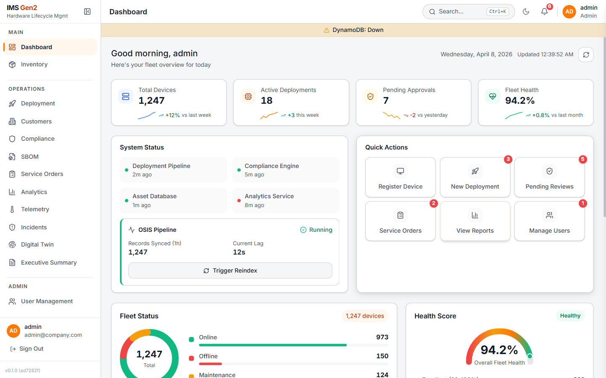
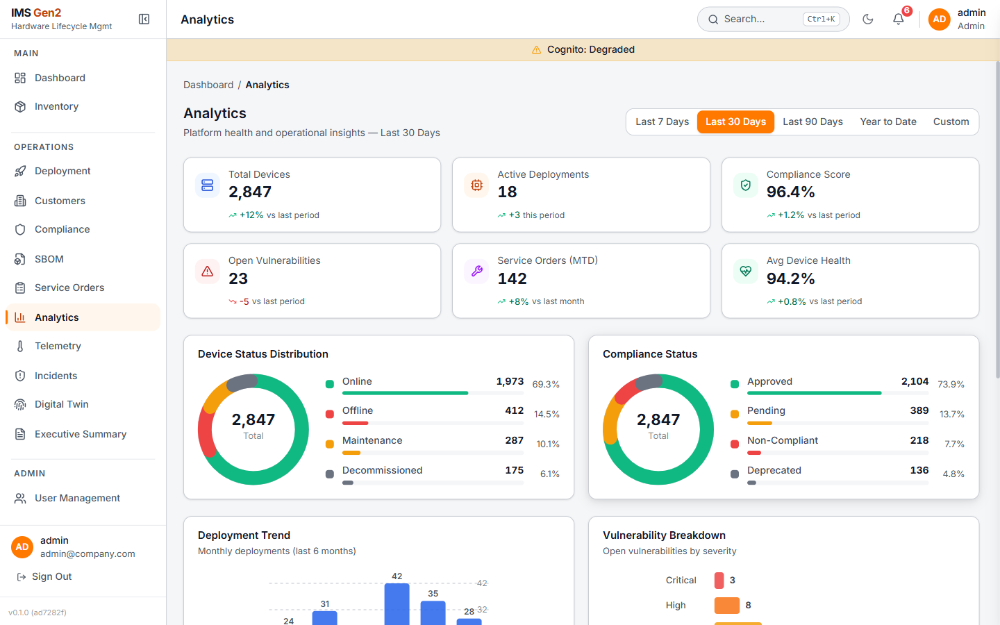
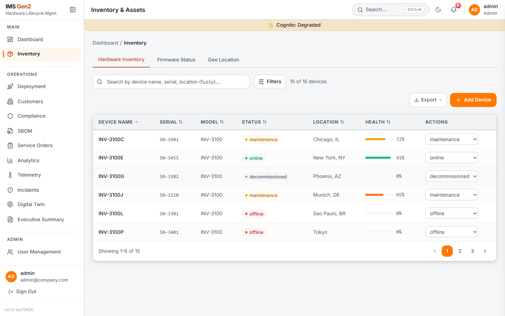
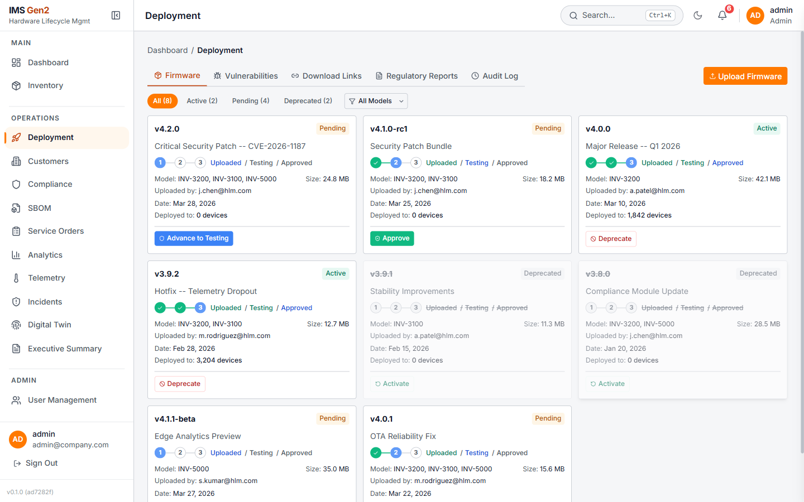
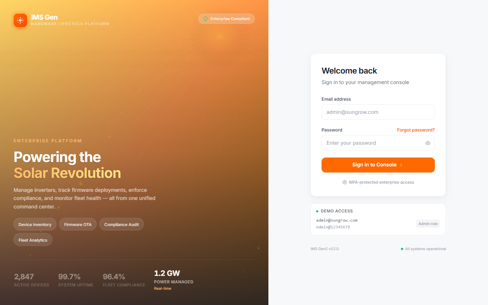
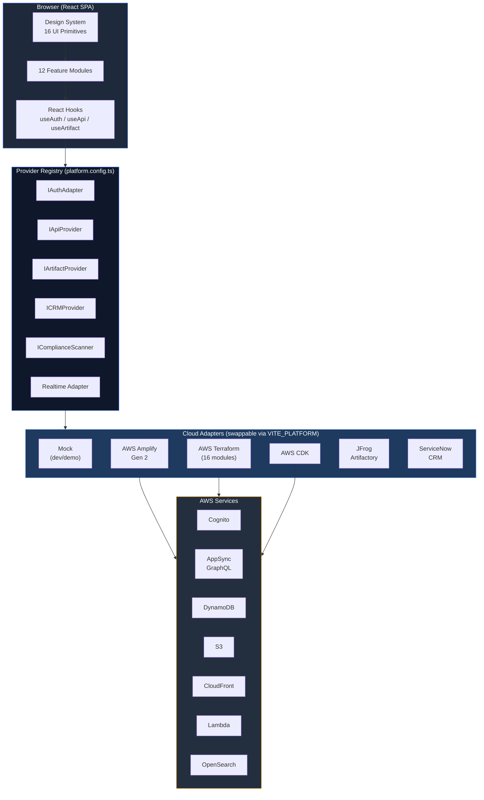
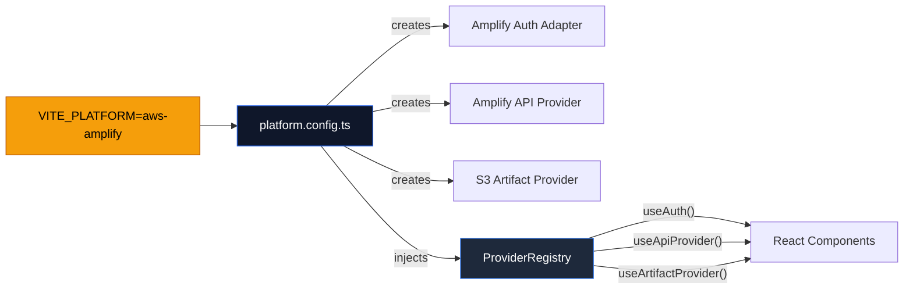
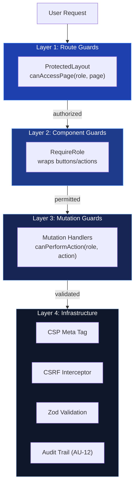

# IMS Gen 2 -- Enterprise React Template

> **Production-ready, cloud-agnostic enterprise application template** with pluggable providers, NIST 800-53 security controls, and multi-IaC infrastructure. Fork it, set 3 env vars, deploy to any cloud.

`Enterprise RBAC` | `NIST 800-53` | `Cloud-Agnostic` | `12 Modules` | `530+ Tests` | `Multi-IaC`

     

---

## Table of Contents

- [Application Preview](#application-preview)
- [Why This Template?](#why-this-template)
- [Quick Start](#quick-start)
- [System Architecture](#system-architecture)
- [Provider Architecture](#provider-architecture-pluggable)
- [Security (NIST 800-53)](#security-nist-800-53-built-in)
- [Infrastructure as Code](#infrastructure-as-code-multi-iac)
- [How to Use as a Template](#how-to-use-as-a-template)
- [Configuration](#configuration)
- [Feature Modules](#feature-modules-12)
- [Design System](#design-system)
- [Testing](#testing)
- [Operational Excellence](#operational-excellence)
- [AI-Powered Development](#ai-powered-development)
- [Tech Stack](#tech-stack)
- [Project Structure](#project-structure)
- [Documentation](#documentation)

---

## Application Preview

|                    Dashboard                    |                    Analytics                    |
| :---------------------------------------------: | :---------------------------------------------: |
|  |  |

|                    Inventory                    |                    Deployment                     |
| :---------------------------------------------: | :-----------------------------------------------: |
|  |  |

<details>
<summary>Login Page</summary>



</details>

---

## Why This Template?

Most enterprise React starters give you a login page and a dashboard. This gives you **everything between "git clone" and "production deployment"**:

| What You Get                              | What You Skip                                        |
| ----------------------------------------- | ---------------------------------------------------- |
| 8 pluggable provider interfaces           | 6-8 weeks of architecture and abstraction design     |
| 5 cloud adapter implementations           | Vendor lock-in and multi-cloud portability debates   |
| 37 NIST 800-53 security controls          | 3-4 months of security audit and remediation cycles  |
| 3 IaC options (Terraform + CDK + Amplify) | 4-6 weeks of infrastructure scaffolding from scratch |
| 12 feature modules with full UI           | 200+ hours of boilerplate page scaffolding           |
| 530+ unit tests + E2E framework           | 2-3 sprints building test infrastructure             |
| Role-based access (5 roles)               | Custom RBAC design, implementation, and QA           |
| CI/CD pipelines (3 workflows)             | DevOps toolchain configuration and tuning            |

**Zero cloud dependency in development.** The app runs entirely in mock mode -- no AWS account, no API keys, no database. When you're ready, flip `VITE_PLATFORM` to connect to real services.

---

## Quick Start

### Prerequisites

| Dependency | Version | Required For                   |
| ---------- | ------- | ------------------------------ |
| Node.js    | 20+     | Build and dev server           |
| npm        | 10+     | Package management             |
| Java       | 17+     | E2E tests only                 |
| Maven      | 3.9+    | E2E tests only                 |
| Terraform  | 1.5+    | Infrastructure deployment only |

### Local Development

```bash
git clone https://github.com/gauravmakkar29/InventoryManagement.git
cd InventoryManagement && npm install
npm run dev
```

Open [http://localhost:5173](http://localhost:5173). Login with any mock credential:

| Email                 | Password           | Role          |
| --------------------- | ------------------ | ------------- |
| `admin@company.com`   | `Admin@12345678`   | Admin         |
| `manager@company.com` | `Manager@12345678` | Manager       |
| `tech@company.com`    | `Tech@123456789`   | Technician    |
| `viewer@company.com`  | `Viewer@12345678`  | Viewer        |
| `customer@tenant.com` | `Customer@123456`  | CustomerAdmin |

---

## System Architecture



---

## Provider Architecture (Pluggable)

The app **never imports a cloud SDK directly**. Every external dependency flows through a provider interface. Swap implementations without touching a single component.



### 8 Provider Interfaces

| Interface                    | Purpose                                       | Implementations               |
| ---------------------------- | --------------------------------------------- | ----------------------------- |
| `IAuthAdapter`               | Sign-in, MFA, token refresh, session          | Mock, Cognito (3 variants)    |
| `IApiProvider`               | 40+ data operations (CRUD, search, telemetry) | Mock, Amplify, CDK, Terraform |
| `IStorageProvider`           | Key-value persistence                         | localStorage (built-in)       |
| `IArtifactProvider`          | Binary file upload/download/versioning        | Mock, S3/Amplify, JFrog       |
| `ICRMProvider`               | Customer & ticket management                  | Mock, ServiceNow              |
| `IComplianceScannerProvider` | Vulnerability scanning & reports              | Mock, Ignite                  |
| `ICDCProvider`               | Change Data Capture / audit streams           | Mock                          |
| `IDNSProvider`               | DNS record management                         | Mock, Azure DNS, Route 53     |

Plus **3 real-time adapters**: WebSocket (auto-reconnect), SSE, and Mock.

---

## Security (NIST 800-53 Built-In)

Not bolted on -- **baked in from day one**. 37 controls across 6 NIST families.



| Family                     | Controls                                                | What It Covers                                            |
| -------------------------- | ------------------------------------------------------- | --------------------------------------------------------- |
| **Access Control (AC)**    | AC-2, AC-3, AC-5, AC-6, AC-7, AC-8, AC-11, AC-12, AC-17 | RBAC, separation of duties, session timeout, login banner |
| **Audit (AU)**             | AU-2, AU-3, AU-4, AU-5, AU-6, AU-8, AU-12               | Audit trail, CDC capture, tamper-evident logs             |
| **Identification (IA)**    | IA-2, IA-2(1), IA-4, IA-5, IA-8                         | MFA (TOTP), password policy, credential management        |
| **Incident Response (IR)** | IR-4, IR-5, IR-6                                        | Playbooks, quarantine, escalation workflows               |
| **Integrity (SI)**         | SI-3, SI-10                                             | XSS prevention (CSP + DOMPurify), Zod input validation    |
| **Config Management (CM)** | CM-3, CM-8                                              | Change tracking, asset inventory                          |

---

## Infrastructure as Code (Multi-IaC)

```mermaid
graph LR
    subgraph IaC["Choose Your IaC"]
        TF["Terraform<br/>16 modules"]
        CDK["AWS CDK<br/>TypeScript"]
        AMP["Amplify Gen 2<br/>Zero-config"]
    end

    subgraph Envs["4 Environments"]
        Dev["Dev"]
        QA["QA"]
        PreProd["Pre-Prod"]
        Prod["Prod"]
    end

    subgraph Services["AWS Services"]
        DDB["DynamoDB"]
        Cog["Cognito"]
        AS["AppSync"]
        S3["S3"]
        CF["CloudFront + WAF"]
        OS["OpenSearch"]
    end

    IaC --> Envs
    Envs --> Services

    style IaC fill:#0f172a,stroke:#f59e0b,color:#fff
    style Envs fill:#1e293b,stroke:#3b82f6,color:#fff
    style Services fill:#232f3e,stroke:#ff9900,color:#fff
```



| IaC Option            | Location                         | Status                       | Best For                                |
| --------------------- | -------------------------------- | ---------------------------- | --------------------------------------- |
| **Terraform**         | `infra/reference/aws-terraform/` | 16 modules, production-ready | Teams with existing Terraform workflows |
| **AWS CDK**           | `infra/reference/aws-cdk/`       | Reference skeleton           | TypeScript-native infrastructure teams  |
| **AWS Amplify Gen 2** | Built into `aws-amplify` adapter | Integrated                   | Greenfield projects wanting zero-config |

<details>
<summary>Terraform Modules (16)</summary>

| Module             | AWS Service                                         |
| ------------------ | --------------------------------------------------- |
| `dynamodb`         | NoSQL tables with streams + PITR                    |
| `cognito`          | User pool + auth groups                             |
| `appsync`          | GraphQL API + resolvers                             |
| `lambda-audit`     | CDC event processor                                 |
| `s3-firmware`      | Artifact bucket (versioned, encrypted, Object Lock) |
| `s3-frontend`      | Static hosting                                      |
| `cloudfront`       | CDN + WAF integration                               |
| `waf`              | Web Application Firewall rules                      |
| `opensearch`       | Full-text + geo search                              |
| `location-service` | Maps, geocoding, geofencing                         |
| `iam`              | Roles + cross-account policies                      |
| `dns`              | Route 53 zones                                      |
| `monitoring`       | CloudWatch + X-Ray                                  |
| `alerting`         | Alarms + SNS notifications                          |
| `cloudtrail`       | API audit logging                                   |

</details>

---

## How to Use as a Template


**Step 1:** Fork & clone, `cp .env.example .env`

**Step 2:** Set `VITE_PLATFORM` (`mock` | `aws-amplify` | `aws-terraform` | `aws-cdk`)

**Step 3:** Edit `src/lib/types.ts` -- replace Device/Firmware with your domain entities

**Step 4:** Implement `IApiProvider` + `IAuthAdapter` in `src/lib/providers/your-platform/`

**Step 5:** Deploy infra: `terraform apply`, `cdk deploy`, or Amplify auto-provisions

**Step 6:** CI/CD pipelines at `.github/workflows/` are ready to use

---

## Configuration

### Environment Variables

Copy `.env.example` to `.env` and configure as needed. The app runs with defaults (mock mode) out of the box.

| Variable                    | Description                              | Default          | Required                   |
| --------------------------- | ---------------------------------------- | ---------------- | -------------------------- |
| `VITE_PLATFORM`             | Platform adapter selection               | `mock`           | Yes                        |
| `VITE_APPSYNC_ENDPOINT`     | AWS AppSync GraphQL endpoint URL         | --               | Only for `aws-amplify`     |
| `VITE_COGNITO_USER_POOL_ID` | Cognito User Pool ID                     | --               | Only for `aws-*` platforms |
| `VITE_COGNITO_CLIENT_ID`    | Cognito App Client ID                    | --               | Only for `aws-*` platforms |
| `VITE_AWS_REGION`           | AWS region for all services              | `ap-southeast-2` | Only for `aws-*` platforms |
| `VITE_STORAGE_ENDPOINT`     | S3/artifact storage endpoint             | --               | No (falls back to mock)    |
| `VITE_SEARCH_ENDPOINT`      | OpenSearch endpoint URL                  | --               | No (falls back to mock)    |
| `VITE_REALTIME_ENDPOINT`    | WebSocket/SSE endpoint for notifications | --               | No (falls back to mock)    |
| `VITE_SHOW_DEVTOOLS`        | Show React Query DevTools                | --               | No                         |

### Available Scripts

| Command                   | Description                              |
| ------------------------- | ---------------------------------------- |
| `npm run dev`             | Start dev server (localhost:5173)        |
| `npm run build`           | TypeScript check + Vite production build |
| `npm test`                | Run unit tests (Vitest)                  |
| `npm run test:coverage`   | Unit tests with Istanbul coverage report |
| `npm run lint`            | ESLint check                             |
| `npm run test:e2e`        | Full E2E regression (Java/Maven/TestNG)  |
| `npm run test:e2e:smoke`  | Smoke E2E suite                          |
| `npm run test:e2e:headed` | E2E in headed browser mode               |

---

## Feature Modules (12)

| Module              | Key Features                                                       |
| ------------------- | ------------------------------------------------------------------ |
| **Dashboard**       | Fleet KPIs, health score gauge, activity feed, quick actions       |
| **Inventory**       | Device table with advanced search, geo map view, bulk operations   |
| **Deployment**      | Firmware lifecycle, multi-stage approval workflow, version history |
| **Compliance**      | Regulatory certification tracking, NIST control mapping            |
| **SBOM**            | Software bill of materials management                              |
| **Service Orders**  | Maintenance scheduling with priority + status workflow             |
| **Analytics**       | Time-series charts, audit logs, CSV/JSON export                    |
| **Telemetry**       | Heatmaps, blast radius simulation, risk scoring                    |
| **Incidents**       | Response playbooks, network topology, device quarantine            |
| **Digital Twin**    | State replay, config drift detection, health trending              |
| **Customers**       | Customer/site management with firmware deployment tracking         |
| **User Management** | Account creation, role assignment, session management              |

---

## Design System

Built on **shadcn/ui (Radix)** with semantic design tokens. Dark/light mode. WCAG 2.1 AA.

16 shared primitives: `dialog-base`, `data-table`, `form-field`, `status-badge`, `confirm-dialog`, `loading-skeleton`, `empty-state`, `stat-card`, `toast`, `dropdown-menu`, `tabs`, `tooltip`, `sidebar-nav`, `command-palette`, `search-input`, `page-header`

All located in `src/components/` -- Radix primitive + Tailwind + `class-variance-authority` + semantic tokens.

---

## Testing

| Type           | Stack                         | Command                  |
| -------------- | ----------------------------- | ------------------------ |
| Unit (530+)    | Vitest + RTL + vitest-axe     | `npm test`               |
| Coverage       | Istanbul                      | `npm run test:coverage`  |
| E2E Regression | Java 17 + Playwright + TestNG | `npm run test:e2e`       |
| E2E Smoke      | Same                          | `npm run test:e2e:smoke` |

---

## Operational Excellence

### Logging

Application logging follows a structured approach:

| Layer              | Mechanism                             | Details                                                              |
| ------------------ | ------------------------------------- | -------------------------------------------------------------------- |
| **Client-side**    | `console.warn` / `console.error` only | `no-console` ESLint rule blocks `console.log` in production code     |
| **Audit trail**    | CDC (Change Data Capture) provider    | Every mutation logged with actor, timestamp, and payload (AU-2/AU-3) |
| **Infrastructure** | CloudTrail + CloudWatch               | API-level audit logging via Terraform `cloudtrail` module            |
| **Error tracking** | `IErrorTrackingProvider`              | Pluggable provider for Sentry/Datadog integration                    |

### Monitoring

| Component       | Tool                    | Location                                            |
| --------------- | ----------------------- | --------------------------------------------------- |
| API latency     | CloudWatch Dashboards   | `infra/reference/aws-terraform/modules/monitoring/` |
| Error rates     | CloudWatch Alarms + SNS | `infra/reference/aws-terraform/modules/alerting/`   |
| Search health   | OpenSearch Dashboards   | `infra/reference/aws-terraform/modules/opensearch/` |
| CDN performance | CloudFront metrics      | `infra/reference/aws-terraform/modules/cloudfront/` |
| Uptime          | X-Ray tracing           | `infra/reference/aws-terraform/modules/monitoring/` |

### Health Checks

The dashboard displays real-time system status for 4 services (Deployment Pipeline, Compliance Engine, Asset Database, Analytics Service) with last-heartbeat timestamps. The OSIS Pipeline widget shows records synced, current lag, and a manual reindex trigger.

### Error Handling

- **API errors** classified by `ApiMutationError` with typed error codes and user-facing messages
- **Route errors** caught by per-route `RouteErrorBoundary` with recovery actions
- **Global errors** caught by top-level `ErrorBoundary` with crash report
- **Network** offline detection via `useConnectivityMonitor` with degraded-mode banner

---

## AI-Powered Development

This project uses **Claude Code** (Anthropic CLI) for AI-native SDLC using the **SPEC Method** framework.

| Capability     | How It Works                                                             |
| -------------- | ------------------------------------------------------------------------ |
| Story creation | Claude drafts stories from epics with ACs, preconditions, and test hints |
| Implementation | TDD-driven coding with automatic rulebook enforcement                    |
| Code review    | Security (NIST), architecture, and performance audits on demand          |
| PR management  | Branch creation, commit formatting, and PR submission with traceability  |
| Backlog audit  | Gap analysis across 18 epics with prioritized recommendations            |

Workflows: `SPEC/workflows/` -- Rulebooks: `SPEC/rulebooks/` -- Hooks: `.claude/settings.json`

---

## Tech Stack

| Layer      | Technology                        | Version |
| ---------- | --------------------------------- | ------- |
| Framework  | React                             | 18.3    |
| Build      | Vite                              | 6.3     |
| Language   | TypeScript (strict)               | 5.7     |
| Styling    | TailwindCSS 4 + shadcn/ui (Radix) | 4.1     |
| State      | Zustand + TanStack React Query    | 5.x     |
| Forms      | react-hook-form + Zod             | 7.x     |
| Charts     | Recharts                          | 2.15    |
| Maps       | react-simple-maps                 | 3.x     |
| i18n       | react-i18next (2 locales)         | --      |
| Unit Tests | Vitest + RTL                      | 3.2     |
| E2E Tests  | Java 17 + Playwright              | --      |
| IaC        | Terraform + CDK + Amplify         | --      |
| CI/CD      | GitHub Actions (3 workflows)      | --      |

---

## Project Structure

```
src/
  app/components/             # 12 feature modules
  lib/providers/              # Provider abstraction layer
    mock/                     #   Mock adapters (dev/demo)
    aws-amplify/              #   Amplify + AppSync + S3
    aws-cdk/                  #   CDK-based adapters
    aws-terraform/            #   Terraform-managed AWS
    jfrog/                    #   JFrog Artifactory
    servicenow/               #   ServiceNow CRM
    realtime/                 #   WebSocket + SSE
  components/                 # 16 shared UI primitives
  locales/                    # i18n (en-US, es-ES)
  __tests__/                  # 530+ unit tests
e2e/ims-e2e/                  # E2E framework (Java/Maven/Playwright)
infra/reference/
  aws-terraform/              # 16 Terraform modules (production-ready)
  aws-cdk/                    # CDK reference skeleton
Docs/                         # Architecture decisions, epic specs
.github/workflows/            # CI/CD pipelines
SPEC/                         # SPEC Method rulebooks + workflows
```

---

## Documentation

| Document               | Path                                                    |
| ---------------------- | ------------------------------------------------------- |
| Demo Walkthrough       | `Docs/demo-walkthrough.md`                              |
| Master Project Brief   | `Docs/IMS-Gen2-Detailed-Project-Brief-For-Terraform.md` |
| App Modules Overview   | `Docs/app-modules-overview.md`                          |
| NIST Control Mapping   | `Docs/nist-800-53-control-mapping.md`                   |
| GitHub Projects Guide  | `Docs/github-projects-guide.md`                         |
| Architecture Decisions | `Docs/decisions/`                                       |
| Integration Contract   | `Docs/integration-contract.md`                          |
| Epic Stories + Specs   | `Docs/epics/epic-{1-18}/`                               |

---

## License

MIT
